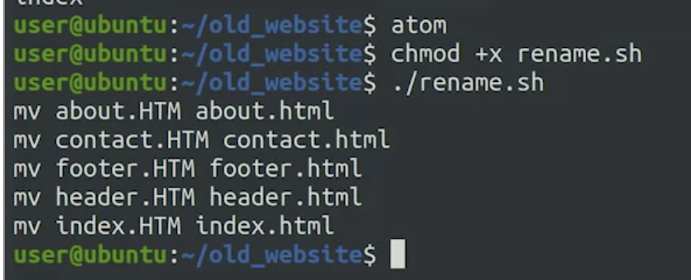

# Advanced Bash Concepts

***Sample While Loop***

```bash
n=1
while [ $n -le 5 ]; do
    echo "Iteration number $n"
    ((n+=1))
done
```


```bash
n=0
command=$1
while ! $command && [ $n -le 5 ]; do
    sleep $n
    ((n=n+1))
    echo "Retry #$n"
```


The above image shows the previous script accepting an input from a python code that outputs 0-3 randomly. If exit code is 0, that's the time the script finishes.

---

## For Loops in Bash Scripts

``` bash
for fruit in peach orange apple; do
    echo "I like $fruit!"
done
```

```bash
#!/bin/bash
for file in *.HTM; do
    name=$(basename "$file" .HTM)
    echo mv "$file" "$name.html"
done
```

