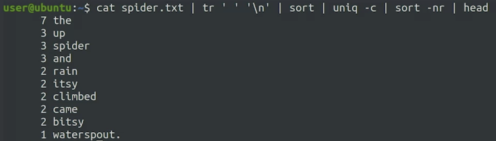

# Piping

Connect multiple scripts, commands into a data processing pipeline.

Connect output of one program to input of another in order to pass data between them.

```bash
| #pipe character
```

---

## First example

Contents of a directory containing lots of files.

`less` allows for output one page at a time.

```bash
ls -l | less
```

---

## Second example



```bash
cat spider.txt | tr ' ' '\n' | sort | uniq -c |sort -nr | head
```

`cat` shows file content

`tr` "translate" takes characters from first parameter into the second parameter.

`sort` alphabetically

`uniq` displays each match once. `-c` shows number of times it occured.

`sort -nr` numerical in reverse order.

`head` first ten lines of stdout.

