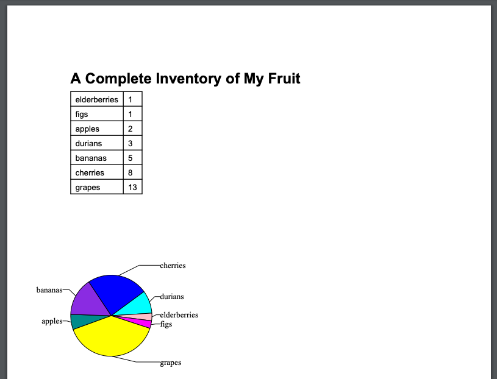

# Sending Emails from Python

# Logging

## Overview

Python offers two primary methods for outputting information: `print()` for simple console outputs and `logging` for more advanced, configurable logging.

### Print Statements

- **Function:** `print()` is a basic function used for debugging and displaying quick information.
- **Limitation:** Not suitable for production due to overhead.

### Logging

- **Advantage:** Allows detailed control over log messages, including level, destination, and format.
- **Levels:** `DEBUG`, `INFO`, `WARNING`, `ERROR`, `CRITICAL` for filtering severity.
- **Application:** Ideal for production-grade applications to monitor and analyze behavior.

### Comparison: Printing vs. Logging

- `print()`: Simple, immediate output to the console. Syntax: `print(object, file=open("new_file.txt", "w"))`.
- `logging`: Object-oriented, allows severity levels, multiple destinations, and filtering.

### Built-in Logging Levels

- Provided by the logging module: `debug`, `info`, `warning`, `error`, `critical`.
- Example:

  ```python
  import logging
  logging.basicConfig(level=logging.DEBUG)
  logging.debug("This is a DEBUG message.")
  ```

### **Handlers in Logging**

- **Function:** Define log message destinations.
- **Types:** **`StreamHandler`**, **`FileHandler`**, **`RotatingFileHandler`**, etc.
- **Usage:** Attach handlers to loggers for advanced management.
- **Custom Logger Example:**

```python
import logging
stream_logger = logging.getLogger('stream_logger')
stream_logger.setLevel(logging.DEBUG)
stream_handler = logging.StreamHandler()
stream_handler.setLevel(logging.INFO)
stream_logger.addHandler(stream_handler)
```

### **Advanced Use Cases**

- Logging business data to a database for monitoring and alerting.

## **Key Takeaways**

- **Print Statement Overhead:** Avoid in production due to overhead.
- **Severity Levels:** Crucial for distinguishing issue severity.
- **Advanced Log Management:** Use handlers for directing messages to various destinations.

## Logging Module

### Overview

The logging module in Python is a versatile tool for both novice and professional developers. It integrates seamlessly with third-party libraries, enabling the creation of a uniform log for applications.

### Key Features

- **Logging Activities:** Records program actions, variable values, output from components, and performance data.
- **Customization:** Allows for tailored log formatting and detail levels.
- **Severity Levels:** Five levels - DEBUG, INFO, WARNING, ERROR, CRITICAL - to classify message importance.

### Severity Levels

1. **DEBUG:** Detailed information for debugging (e.g., parameter values).
2. **INFO:** General program activity (e.g., database connections).
3. **WARNING:** Non-critical errors (e.g., slow queries, missing config files).
4. **ERROR:** Serious, recoverable errors (e.g., failed database connections).
5. **CRITICAL:** Fatal errors leading to program termination.

### Logger Initialization

- **Basic Setup:** Import the logging module, set the minimum level (e.g., INFO), and create a logger instance with `__name__`.
- **Example:**

  ```python
  import logging
  logging.basicConfig(level=logging.INFO)
  log = logging.getLogger(__name__)
  log.info("Hello world")
  ```

### **Alternatives to Logging Module**

- **structlog:** Outputs logs in structured JSON format for easy parsing by monitoring systems.
- **colorlog:** Adds color highlights to log levels for easy identification in the console.

## Exception Handling in Python

### Overview

Exception handling in Python is crucial for managing errors that disrupt the normal flow of a program. It helps to ensure that a program does not crash and provides a way to respond to errors effectively.

### Examples of Exceptions

- Dividing by zero
- Referencing a nonexistent variable
- Opening a nonexistent file
- Failing to connect to a remote server

## Common Types of Exceptions

- **NameError:** Typo in a variable name
- **AttributeError:** Mistake in calling a method on an object
- **ValueError:** Incorrect parameter value
- **TypeError:** Wrong type or number of arguments in a function call
- **ImportError:** Python unable to find a module
- **FileNotFoundError:** Operations on a nonexistent file or directory

## `except` Statements

The `except` statement in Python is used to catch and handle specific exceptions. It allows for recovery from errors or user notification.

### Example

```python
try:
    f = open("/etc/hosts", "w+")
except IOError as ex:
    print("Error appending to file: " + str(ex))
else:
    f.close()
```

## Exception Handling in Python

Exception handling in Python is used to manage errors or exceptions during program execution. The key commands include `try/except`, `raise`, and `finally`.

## Using `try/except`

`try/except` is used when there's a possibility of an error occurring. It acts as a safety net to catch errors.

### Example 1: Handling Undefined Variables

```python
try:
  print(x)
except NameError:
  print("Variable x is not defined")
```

### Example 2: Handling File Operations

```python
try:
  f = open("/etc/hosts", "w+")
  f.write("Success!")
except FileNotFoundError:
  print("Data file not found")
except Exception as ex:
  print("Error appending to file: " + str(ex))
else:
  f.close()
```

### Using `raise`

`raise` is used to signal an error condition, stopping the program when it can't continue due to an error or incorrect input.

#### Example 1: Type Checking

```python
x = "hello"
if not isinstance(x, int):
  raise TypeError("Only integers are allowed")
```

#### Example 2: Validating Port Numbers

```python
def start_server(port):
  if not isinstance(port, int):
    raise TypeError("Port number must be an integer")
  elif port < 1024 or port > 65535:
    raise ValueError("Port number is invalid")
```

### Using `finally`

`finally` is used for cleanup actions that must occur whether an exception was raised or not. It's often used for releasing resources.

#### Example: Ensuring Resource Cleanup

```python
try:
  f = open("/etc/hosts", "w+")
except Exception as ex:
  print("Error appending to file: " + str(ex))
finally:
  if 'f' in locals():
      f.close()  # Closes the file if it was opened
```

### Key Takeaways

`try/except` allows catching errors before they crash the program.
`raise` signals when a code can't continue due to an error.
`finally` ensures cleanup actions are executed regardless of exception

## Introduction to Python Email Library

### Overview

Creating email messages in Python is simplified by the `email` module, which adheres to the SMTP (Simple Mail Transfer Protocol) and MIME (Multipurpose Internet Mail Extensions) standards.

### Creating an Email Message

- **Class Used:** `email.message.EmailMessage`
- **Steps:**
  1. Import and create an empty email message:

     ```python
     from email.message import EmailMessage
     message = EmailMessage()
     print(message)
     ```

  2. Define sender and recipient:

     ```python
     sender = "me@example.com"
     recipient = "you@example.com"
     ```

  3. Add sender and recipient to the message:

     ```python
     message['From'] = sender
     message['To'] = recipient
     print(message)
     ```

### Adding Email Components

- **Subject Line:**

  ```python
  message['Subject'] = 'Greetings from {} to {}!'.format(sender, recipient)
  print(message)
  ```

### Message Body

```python
body = """Hey there!
I'm learning to send emails using Python!"""
message.set_content(body)
print(message)
```

### **Understanding Email Headers**

- **Headers Used:** From, To, and Subject
- **Purpose:** Key-value pairs that guide email clients and servers.
- **Additional Headers:** Automatically added by **`set_content()`**, like MIME-Version, Content-Type, and Content-Transfer-Encoding, to inform how to process the email content.

### **Key Takeaways**

- The **`email`** module in Python simplifies the process of creating email messages, compliant with SMTP and MIME standards.
- Email messages consist of headers (From, To, Subject) and the message body, with additional headers for content type and encoding.
- MIME-Version and Content-Type headers are essential for the correct interpretation of email content across various clients and servers.

## Sending the Email Through an SMTP Server

To send emails, Python utilizes the Simple Mail Transfer Protocol (SMTP) with the `smtplib` module.

```python
import smtplib
mail_server = smtplib.SMTP('localhost')
```

```markdown
Traceback (most recent call last):
  File "<stdin>", line 1, in <module>
  (...We deleted a bunch of lines here...)
ConnectionRefusedError: [Errno 61] Connection refused
```

- **Local SMTP Server:** Attempting to create a local server may result in **`ConnectionRefusedError`**.
- **Remote SMTP Server:** Use a remote SMTP server of your personal email service.

### **Secure Connection and Authentication**

- **Secure Connection:** Use **`smtplib.SMTP_SSL`** for a secure SMTP connection over SSL/TLS.

```python
mail_server = smtplib.SMTP_SSL('smtp.example.com')
```

- **Debugging**: Set debug level to see SMTP messages.

```python
mail_server.set_debuglevel(1)
```

- **Authentication**
  - Use **`getpass`** to securely input password.

    ```python
    import getpass
    mail_pass = getpass.getpass('Password? ')
    ```

  - Login using the SMTP object's **`login`** method.

    ```python
    mail_server.login(sender, mail_pass)
    ```

  - `mail_pass` is still an ordinary string.

    ```python
    print(mail_pass)
    #It'sASecr3t!
    ```

  - SMTP login

    ```python
    mail_server.login(sender, mail_pass)
    #(235, b'2.7.0 Accepted')
    ```

### **Sending the Email**

- **Method:** **`send_message`** sends the email.

```python
mail_server.send_message(message)

```

- **Response:** Returns a dictionary of recipients who couldn’t receive the message.

### **Closing the Connection**

```python
mail_server.quit()

```

---

## Generating PDFs

In Python, when you want to create a custom PDF report, the **`ReportLab`** library is a powerful tool you can use. It offers a range of features for PDF generation, but we'll focus on the basics here, particularly using the PLATYPUS system within ReportLab.

### **Creating a PDF Report with ReportLab**

1. **Representing Data**:
First, let's say you have a collection of fruit data represented in a Python dictionary:

    ```python
    fruit = {
      "elderberries": 1,
      "figs": 1,
      "apples": 2,
      "durians": 3,
      "bananas": 5,
      "cherries": 8,
      "grapes": 13
    }
    
    ```

2. **Setting Up the PDF Document**:
Use the **`SimpleDocTemplate`** class to start building your PDF.

    ```python
    from reportlab.platypus import SimpleDocTemplate
    report = SimpleDocTemplate("/tmp/report.pdf")
    
    ```

    This code creates a **`report`** object targeting the output file **`/tmp/report.pdf`**.

3. **Working with Flowables**:
    - Import Flowable classes:

        ```python

        from reportlab.platypus import Paragraph, Spacer, Table, Image
        
        ```

        These classes (Paragraph, Spacer, Table, Image) are used to build elements in your document.

    - Setting up styles:

        ```python

        from reportlab.lib.styles import getSampleStyleSheet
        styles = getSampleStyleSheet()
        
        ```

        You can use the default styles like **`h1`** for headers.

    - Adding a title:

        ```python

        report_title = Paragraph("A Complete Inventory of My Fruit", styles["h1"])
        
        ```

4. **Building the PDF**:
    - Combine the elements and build the PDF:This line generates a PDF with the specified title.

        ```python

        report.build([report_title])
        
        ```


### Adding Tables

Adding tables to your PDF reports in Python using ReportLab can enhance the readability and structure of the information. Here's how you can do it:

### **Converting Dictionary to a List of Lists**

Given a dictionary of fruit inventory, convert it into a list-of-lists format suitable for creating a table. For example:

```pytho
fruit = {"elderberries": 1, "figs": 1, "apples": 2, "durians": 3, "bananas": 5, "cherries": 8, "grapes": 13}
table_data = [[key, value] for key, value in fruit.items()]

```

This code transforms the **`fruit`** dictionary into a list-of-lists called **`table_data`**.

### **Creating the Table in the Report**

- **Creating a Table Object**:

    ```python
    from reportlab.platypus import Table
    report_table = Table(data=table_data)
    
    ```

- **Building the PDF with the Table**:This builds the PDF with the title and the newly added table.

    ```python
    report.build([report_title, report_table])
    
    ```

### **Adding Style to the Table**

- **Importing TableStyle**:

    ```python
    from reportlab.lib import colors
    from reportlab.platypus import TableStyle
    
    ```

- **Defining and Applying the Style**:This code adds a black grid to the table and aligns it to the left.

    ```python
    table_style = [('GRID', (0, 0), (-1, -1), 1, colors.black)]
    report_table = Table(data=table_data, style=table_style, hAlign="LEFT")
    report.build([report_title, report_table])
    
    ```

### **Result**

After adding the table with the specified style, the PDF report becomes more structured and visually appealing, making the data easier to read.

Adding graphics, such as pie charts, to your PDFs in Python can be accomplished with ReportLab's **`Drawing`** Flowable class. Here's how you can incorporate a graphical element into your report:

### **Adding Graphics**

1. **Import Necessary Classes**:

    ```python
    from reportlab.graphics.shapes import Drawing
    from reportlab.graphics.charts.piecharts import Pie
    
    ```

    These imports are necessary for creating the pie chart.

2. **Initialize the Pie Chart**:

    ```python
    report_pie = Pie(width=3*inch, height=3*inch)
    
    ```

    Here, you're creating a **`Pie`** object with specified dimensions.

3. **Prepare Data and Labels**:
To populate the pie chart, convert your fruit dictionary into two lists - one for the data and one for the labels. Sort the fruits alphabetically for added clarity.

    ```python
    report_pie.data = []
    report_pie.labels = []
    for fruit_name in sorted(fruit):
        report_pie.data.append(fruit[fruit_name])
        report_pie.labels.append(fruit_name)
    
    ```

    This code sorts the fruit names and appends their respective quantities and names to the **`data`** and **`labels`** attributes of the **`Pie`** object.

4. **Embedding the Pie Chart into a Drawing**:
Since a **`Pie`** object isn't Flowable, it needs to be placed inside a **`Drawing`** object.

    ```python
    report_chart = Drawing()
    report_chart.add(report_pie)
    
    ```

    This places the pie chart within a drawable area.

5. **Adding the Drawing to the Report**:
Finally, add this drawing to your report:

    ```python
    report.build([report_title, report_table, report_chart])
    
    ```

    This line constructs the PDF with the title, table, and pie chart.

### **Result**

The final PDF should now contain a title, a styled table, and a colorful pie chart representing your data.




---

## DevOps

## **Summary of DevOps**

DevOps represents a significant shift in the IT industry, focusing on bridging the gap between development (Dev) and operations (Ops) teams. Historically, these teams worked in silos, leading to inefficiencies and a lack of cohesive understanding of the software lifecycle. DevOps addresses these issues by promoting collaboration, automation, and continuous improvement.

### **Definition and Context**

**DevOps**: A set of practices that combines software development (Dev) and IT operations (Ops) with the aim to shorten the systems development life cycle and provide continuous delivery with high software quality.

#### **Problems with Traditional Approach**

- **Lack of Understanding**: IT operations teams often lacked complete understanding of the software they were deploying.
- **Knowledge Gaps**: Development teams were not fully aware of how their applications performed in production.
- **Inefficiency**: The traditional, siloed approach was inefficient and lacked cohesiveness.

### **Core Principles of DevOps**

1. **Collaboration**: Encouraging teamwork between development and operations.
2. **Automation**: Streamlining the development process, from building to monitoring, for stability and predictability.
3. **Continuous Improvement**: Constantly seeking enhancements in processes, tools, and team communication.
4. **Customer Mindset**: Focusing on user feedback to create enjoyable and functional software.
5. **End-Goal Focus**: Understanding customer needs and developing solutions that address real problems.

### **Implementation and Impact**

- **Example**: A streaming service company transitioning to cloud-based microservices as part of adopting DevOps principles.
- **Benefits**: Improved software quality, faster delivery times, and enhanced reliability.
- **Challenges**: Requires a cultural shift, willingness to collaborate, and learning new automation tools.

**Additional Context and Terminologies:**

- **Microservices**: An architectural style that structures an application as a collection of loosely coupled services.
- **Continuous Integration and Delivery (CI/CD)**: A method to frequently deliver apps to customers by introducing automation into the stages of app development.
- **Cloud-Native**: Applications that are built and run in a cloud environment, leveraging cloud computing advantages.

## **Sources**

- [What is DevOps?](https://www.atlassian.com/devops) - Atlassian.
- [Microservices](https://www.ibm.com/cloud/learn/microservices) - IBM Cloud Learning Center.

## SLAs

## **Summary of Service-Level Agreements (SLAs)**

Service-Level Agreements (SLAs) are critical components in the operations and tech industry, acting as formalized promises between vendors and their clients. They set expectations for service quality and outline repercussions for not meeting these standards.

### **Definition and Context**

**Service-Level Agreement (SLA)**: A legally binding agreement or part of a contract between a service provider and its client, ensuring a minimum level of service performance.

#### **Relationship with Service-Level Objectives (SLOs)**

- **SLOs**: Specific measurable characteristics of the SLA, such as uptime, speed, and reliability.
- **SLAs and SLOs**: SLAs outline specific SLOs and define penalties for not achieving them.

### **Importance of SLAs**

- **Trust and Reliability**: They build trust between service providers and clients.
- **Accountability**: SLAs hold providers accountable for their service quality.
- **Clarity**: They provide clear expectations and consequences, reducing ambiguity in service delivery.

### **Components of SLAs**

- **Performance Metrics**: Criteria like uptime, responsiveness, and responsibilities.
- **Consequences**: Penalties for not meeting agreed standards, which may include financial penalties or contract termination.

### **Industry Examples**

- For detailed examples and templates, it's advised to refer to industry-specific SLA documents.

### **Key Takeaways**

- **Contractual Nature**: SLAs are often part of a sale contract.
- **Guarantees**: They provide guarantees for a certain level of service performance.
- **Financial Implications**: Violating SLAs can result in financial penalties.
- **Informed Decisions**: Understanding SLAs is crucial for service providers to make strategic decisions regarding investment in reliability.

**Additional Context and Terminologies:**

- **Reliability**: The probability that a system will perform satisfactorily for a specified time under specified conditions.
- **Uptime**: The amount of time a service is available and operational.

### **Sources**

- [Understanding SLAs](https://www.ibm.com/cloud/learn/sla) - IBM Cloud Learning Center.
- [Service-Level Objectives](https://cloud.google.com/blog/products/management-tools/service-level-objectives-a-key-to-reliable-software-systems) - Google Cloud Blog.

## SLO


Service-Level Objectives (SLOs) are crucial elements in the tech and operations industries, serving as benchmarks for quality and performance. They play a key role in setting and managing expectations for service delivery.

### **Definition and Purpose**

- **Service-Level Objective (SLO)**: A specific, measurable component within a Service-Level Agreement (SLA), focusing on aspects like uptime and response time.
- **Function of SLOs**: They establish customers' expectations and guide IT and DevOps teams towards achievable performance goals.

### **Relationship with SLAs and SLIs**

- **Service-Level Agreements (SLAs)**: Broader agreements that encompass SLOs.
- **Service-Level Indicators (SLIs)**: Specific metrics used to measure the achievement of SLOs.
- **SLOs in Context**: SLOs bridge the gap between the high-level commitments in an SLA and the measurable aspects denoted by SLIs.

### **Writing Effective SLOs**

- **Clarity and Simplicity**: SLOs should be written in a clear and straightforward manner.
- **Measurable and Attainable**: They must be quantifiable and realistically achievable to avoid setting up for failure.

### **Example of SLOs in Practice**

- **Scenario**: An IT company's SLA includes maintaining 99% uptime for an application.
- **Specific SLOs**:
    - The application's home page should load in 10 seconds or less 99% of the time.
    - The page should return an HTTP 200 (success) code 99% of the time.
- **Monitoring and Tracking**: Use of monitoring tools to periodically test and track real-world performance against these SLOs.

### **Key Takeaways**

- **Importance of SLOs**: They are vital in fulfilling the promises made in SLAs.
- **Setting Expectations**: SLOs help in aligning customer expectations with service delivery.
- **Guidance for Teams**: They provide clear objectives for IT and DevOps teams to aim for, ensuring service reliability.

### **Additional Context and Terminologies**

- **Reliability Investment**: Decisions on resource allocation are often influenced by the requirements to meet SLOs.
- **Uptime**: A common SLO metric, referring to the percentage of time a service is operational and accessible.

### **Sources**

- The provided text.
- [SLOs and Their Role in Reliability](https://www.sre.google/sre-book/service-level-objectives/) - Google Site Reliability Engineering Book.
- [Understanding SLOs and SLIs](https://cloud.google.com/blog/products/management-tools/service-level-objectives-a-key-to-reliable-software-systems) - Google Cloud Blog.

## **Service-Level Indicators (SLIs)**

Service-Level Indicators (SLIs) are essential metrics in the DevOps and software development realms. They provide real-time performance measurements of applications, playing a crucial role in evaluating service reliability.

### **Definition and Role**

- **Service-Level Indicator (SLI)**: A metric used to quantitatively measure the performance of an application against predefined objectives.
- **Purpose of SLIs**: To assess if an application is meeting its Service-Level Objectives (SLOs) and adhering to the Service-Level Agreement (SLA).

### **Relationship with SLAs and SLOs**

- **Service-Level Agreements (SLAs)**: Broader agreements that set the overall expectations for service delivery.
- **Service-Level Objectives (SLOs)**: Specific goals or targets within an SLA.
- **SLIs in Context**: SLIs provide the data to evaluate whether SLOs are being met within the framework of the SLA.

### **Monitoring and Measurement**

- **Importance of Monitoring**: Continuous monitoring of SLIs is vital to ensure service reliability and adherence to SLOs.
- **Tools for Monitoring**: Platforms like DataDog or AppDynamics can track SLIs by simulating user interactions and recording performance metrics.

### **Example of SLIs in Action**

- **Scenario**: An IT company's SLA stipulates 99% uptime, with the home page loading correctly within 10 seconds.
- **Relevant SLIs**:
    - Page load time.
    - The rate of successful page loads (HTTP 200 responses).
- **Use of Monitoring Tools**: Tools like DataDog perform synthetic checks to measure these metrics, providing data on service performance.

### **Key Takeaways**

- **Making Objectives Measurable**: SLIs turn the qualitative goals of SLOs into quantifiable data.
- **Data-Driven Performance Analysis**: They provide concrete evidence of how well a service is performing.
- **Overall Service Reliability**: SLAs, SLOs, and SLIs collectively contribute to maintaining and enhancing service reliability.


### **Additional Context and Terminologies**

- **Synthetic Monitoring**: A method where simulated users test and measure application performance.
- **HTTP 200 Response**: An indicator of successful communication between a client and a server in web transactions.

### **Sources**

- The provided text.
- [SLIs, SLOs, and SLAs](https://cloud.google.com/blog/products/gcp/sre-fundamentals-slis-slos-and-slas) - Google Cloud Blog.
- [Monitoring and Observability](https://www.datadoghq.com/blog/monitoring-101-collecting-data/) - DataDog Blog.

## **Error Budgets in Service Operations**

### **Introduction**

Error budgets are a crucial concept in service operations, particularly in fields like cloud operations, site reliability engineering, and DevOps. They function as a tangible metric to balance reliability and innovation in software and service delivery.

### **Definition and Calculation**

- **Error Budget**: The maximum allowable time that a service or software program can fail or be unavailable without breaching its Service-Level Objective (SLO).
- **Representation**: Often expressed as a percentage.
- **Calculation Example**:
    - For a 99.9% uptime SLO in a 30-day month:
    - Total Time = 30 days * 24 hours/day * 60 minutes/hour = 43,200 minutes.
    - SLO as a Decimal = 99.9% = 0.999.
    - Error Budget = Total Time * (1 - SLO) = 43,200 minutes * (1 - 0.999) = 43.2 minutes.

### **Role of Error Budgets**

- **Operational Guidance**: Error budgets guide operational decisions, indicating when to prioritize reliability over new feature development.
- **Innovation vs. Reliability**: If the error budget is ample, teams can focus on innovation; if it's limited, the priority shifts to reliability.
- **Limit Setting**: Helps in setting clear boundaries for development and programming teams regarding the acceptable level of service downtime.

### **Practical Applications**

- **Balancing Act**: Error budgets help balance the desire to release new features with the need to maintain service reliability.
- **Innovation Opportunities**: When error budgets are not exhausted, teams can experiment with new developments, enhancing the product or service.
- **Focus on Reliability**: In scenarios where the error budget is tight, the focus remains on ensuring consistent and reliable service.

### **Key Takeaways**

- **Measurement of Tolerance**: Error budgets measure how much service downtime is tolerable without violating SLO agreements.
- **Influence on Development**: They inform developers about the feasibility of implementing new features based on the available error budget.
- **Innovation vs. Stability**: Higher error budgets allow for more experimentation and innovation, while lower budgets necessitate a focus on stability and reliability.

### **Additional Context and Terminologies**

- **Service-Level Objective (SLO)**: A specific target for service reliability, usually expressed as a percentage.
- **Site Reliability Engineering (SRE)**: A discipline that incorporates aspects of software engineering and applies them to infrastructure and operations problems.

### **Sources**

- The provided text.
- [Understanding Error Budgets](https://cloud.google.com/blog/products/gcp/sre-fundamentals-error-budgets-and-error-budget-policies) - Google Cloud Blog.
- [Error Budgets and SRE Practices](https://sre.google/sre-book/implementing-slos/) - Google Site Reliability Engineering Book.