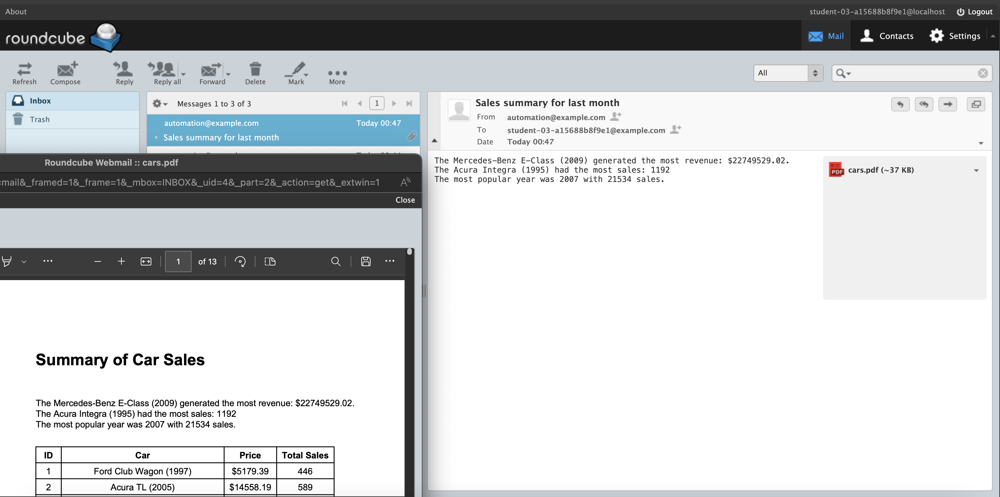

# Module 3 Project: Automatically Generate a PDF and send it by Email

## **Project Overview**

### **Context**

You are employed at a company specializing in the sale of second-hand cars. The company's management team requires a concise summary of monthly vehicle sales. While the company already possesses a web service that provides sales data at the end of each month, there is a need for this data to be presented in a more accessible format.

### **Objective**

The primary objective of this project is to develop a Python script that accomplishes the following tasks:

1. **Summarization and Categorization:** The script should be capable of processing and summarizing the sales data into various meaningful categories.
2. **PDF Generation:** It should generate a PDF document encapsulating the summarized sales data. This document should be structured to enhance readability and comprehension.
3. **Automated Email Dispatch:** Upon successful generation of the PDF report, the script should automatically send this document via email, ensuring that the management team receives timely and easy-to-read sales summaries.

### **Expected Outcomes**

- A Python script that accurately processes and categorizes sales data.
- Automated generation of a reader-friendly PDF report based on the processed data.
- Implementation of an email dispatch system within the script to ensure the PDF report is emailed promptly at the end of each month.

### Scripts to accomplish the above are in `scripts` folder:

`automating-with-python/m3-automatic-output-gen/student/scripts`

### Confirmation of completion:

