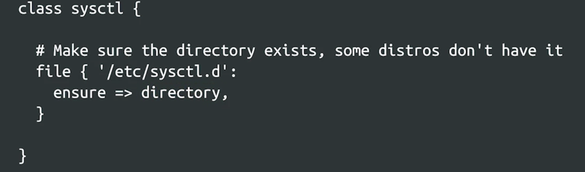
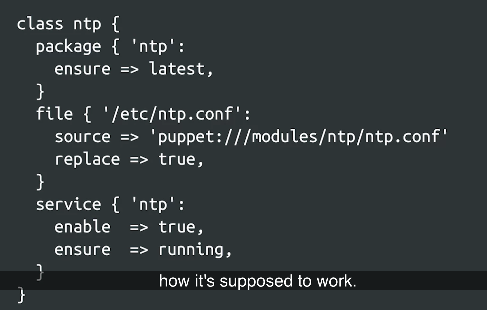
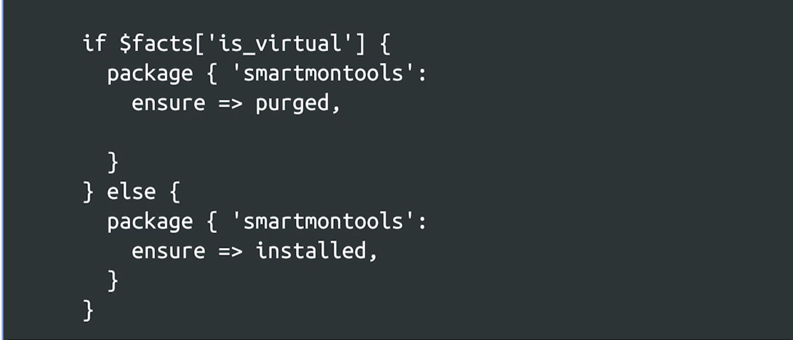

# Automating with Config Management

## Intro to Automation at Scale

### What is Scale?

*Understanding Scalability*

- Scalability means achieving larger impacts with the same effort.
- A scalable system can handle increased workload by increasing capacity.

*Scalability in Web Applications*

- A scalable web application can accommodate more users with more servers.
- Adding servers increases capacity and maintains flexibility.

*Evaluating Scalability*

- Assess the ease of adding new servers.
- Consider server preparation, installation, and configuration.
- Evaluate speed and simplicity of scaling operations.
- Can the IT team manage larger deployments without hiring more staff?

*Scalability Beyond Websites*

- Scalability applies to various aspects of IT, not just web serving.
- Onboarding processes, system administration, network growth need scalability.
- Security policies, user needs, and support with growing user base.

*Importance of Automation*

- Automation is crucial for handling growth and scalability.
- Achieve more tasks in the same time frame with automation tools.
- Deploy servers, create user accounts, and manage systems automatically.

*Automation for Scalability*

- Automate server deployment with single commands.
- Create user accounts and permissions based on stored data.
- Allows small IT teams to manage large numbers of computers.

### What is Config Management?

**Configuration Management and Automation**

*Definition of Configuration*

- Configuration encompasses all settings, policies, and setups for devices.
- It includes operating systems, applications, and relevant files.

*Unmanaged vs. Managed Configuration*

- Unmanaged configuration involves manual deployment and changes.
- Scaling challenges arise with manual configurations as the number of devices increases.
- Automation through configuration management systems solves scaling issues.

*Configuration Management Systems*

- Configuration management systems automate device configuration.
- Define rules to apply to managed nodes (devices).
- Ensure consistency, repeatability, and automation in applying configurations.
- Automatic error correction capabilities in some systems.

*Benefits of Configuration Management*

- Large deployments become easier to manage.
- Changes are made systematically and consistently across devices.
- Continuous monitoring and enforcement of desired configurations.
- Integration with Cloud environments is common.

*Popular Configuration Management Tools*

- Puppet, Chef, Ansible, CFEngine are popular tools.
- Some platform-specific tools like SCCM and Group Policy for Windows.
- Choose the tool that best fits your specific infrastructure needs.

*Focus on Puppet in the Course*

- Puppet is an industry-standard configuration management tool.
- Selection should align with specific infrastructure requirements.

*Infrastructure as Code Paradigm*

- Infrastructure as Code (IaC) integrates configuration management with coding principles.
- Use code to define and manage infrastructure configurations.
- Facilitates automation, version control, and reproducibility of infrastructure setups.

### What is infrastructure as code?

**Infrastructure as Code (IaC)**

- IaC involves writing rules to describe how computers in a fleet should be configured.
- These rules are executed by automation to achieve the desired state.
- IT infrastructure behavior can be modeled in files processed by automated tools.
- Configuration files can be tracked in a version control system (VCS).
- VCS helps track changes, provides an audit trail, and facilitates rollbacks.
- IaC is applied when all configuration necessary to manage a node is stored in version-controlled files.
- This approach is used with automatic tooling to provision and manage nodes.
- IaC is not limited to large data centers; it can be applied to various environments.
- It ensures consistency, repeatability, and scalability in managing infrastructure.
- Machines are treated as replaceable resources, not unique entities.
- Infrastructure can be rapidly deployed, de-provisioned, and redeployed.
- Viewing infrastructure this way helps IT teams adapt to changes in the technology industry.
- Automation and configuration management are essential in embracing change.

**Version Control System (VCS)**

- Tracks changes made to configuration files.
- Offers an audit trail, rollback capabilities, and collaboration benefits.
- Allows others to review code, catch errors, and distribute knowledge.
- Improves infrastructure management and helps recover from outages.
- Automated tests can be run on configuration files to identify issues early.

**Scalable Infrastructure**

- Scalable infrastructure must accommodate capacity requirements.
- Adding more servers is just one aspect; consider network capacity and backend server load.
- Treating computers as cattle (interchangeable) rather than pets (unique) is a common approach.

### What is Puppet?

**Puppet Overview:**

- Puppet is an industry-standard tool for managing the configuration of computers in a fleet of machines.
- It is an open-source project created in 2005 and has evolved through various versions.
- The latest version mentioned is Puppet 6, released in late 2018.
- Puppet is a cross-platform tool, compatible with Linux distributions, Windows, and macOS.

**Puppet Architecture:**

- Puppet typically uses a client-server architecture, consisting of the Puppet agent (client) and the Puppet master (server).
- The agent sends system information (facts) to the master, which generates a list of rules (manifests) for the agent to apply.
- The agent is responsible for making necessary changes on the local computer based on the received rules.

**Rules in Puppet:**

- Puppet rules, also known as manifests, define the desired configuration state of a system.
- Puppet can manage packages, configuration files, registry entries (on Windows), services, crontab jobs, users, groups, and execute external commands.
- Puppet's syntax for writing rules is introduced, with an example of a rule to ensure the presence of the 'sudo' package on target computers.
- Puppet automates package installation based on the operating system and its package management system.

**Resource Types:**

- Puppet uses resource types to define rules. Resource types represent specific system attributes like packages, files, services, etc.
- Resource types are used to manage system resources. Puppet has built-in resource types for various tasks.
- Resource types abstract the underlying system details, making it cross-platform compatible.

### Puppet Resources

**Puppet Resources:**

- Resources in Puppet are the fundamental units for modeling configurations to be managed.
- Each resource specifies a configuration that Puppet should manage, such as a service, package, or file.

**Resource Declaration Syntax:**

- When declaring a resource in Puppet, it is written within a block.
- The block starts with the resource type (e.g., File) and is enclosed in curly braces.
- After the opening curly brace, the title of the resource is specified, followed by a colon.
- Attributes for the resource are then set inside the block.
- Example of a file resource declaration: **`file { '/etc/sysctl.d': ensure => 'directory' }`**

**File Resource Examples:**

1. **Directory Existence**: A file resource ensures that the directory **`/etc/sysctl.d`** exists. The **`ensure`** attribute is set to **`'directory'`**.
2. **File Content**: A file resource is used to configure the contents of **`/etc/timezone`**. It sets attributes like **`ensure`** to **`'file'`**, **`content`** to the UTC timezone, and **`replace`** to **`true`**, indicating that the contents should be replaced if the file already exists.

**Additional Resource Attributes:**

- Puppet resources can have various attributes, depending on the type of resource.
- Attributes can include file permissions, file owner, file modification time, and more.
- The official Puppet documentation provides a comprehensive list of possible attributes for each resource type.

**Resource Implementation:**

- Puppet resources, when declared in Puppet manifests (rules), define the desired state of the resource in the system.
- The Puppet agent processes these resources and uses providers to enforce the desired state.
- The provider is chosen automatically based on the resource type and the environment in which Puppet is running.
- The provider's code is responsible for making the system reflect the desired state specified in the resource.

### Puppet Classes

**Puppet Classes:**

- Puppet classes are used to collect related resources in a single place.
- Classes are a way to organize and manage configuration elements that work together to achieve a specific goal.
- For example, a class could contain resources related to installing a package, configuring a file, and starting a service.

**Class Example - NTP Configuration:**

- In the example provided, a class is created to manage Network Time Protocol (NTP) configuration.
- This class contains three resources: a package (to ensure the NTP package is upgraded), a file (to set the NTP configuration file), and a service (to enable and start the NTP service).
- Grouping these related resources in a class makes it easier to understand and manage the NTP configuration as a whole.

**Use Cases for Puppet Classes:**

- Puppet classes are useful for grouping related resources in a logical and organized manner.
- They can be used to manage various aspects of system configuration, such as log files, time zones, temporary files, directories, web serving software, email infrastructure, firewall settings, and more.
- Classes provide a clear structure for defining and managing configurations in Puppet code.

### Puppet Resources

Check out the following links for more information:

- https://puppet.com/docs/puppet/latest/lang_resources.html
- https://puppet.com/blog/deploy-packages-across-your-windows-estate-with-bolt-and-chocolatey/

## The Building Blocks of Configuration Management

### What are domain-specific languages?

**Puppet DSL:**

- Puppet uses a domain-specific language (DSL) designed specifically for configuration management.
- Unlike general-purpose programming languages like Python, Ruby, Java, or Go, the Puppet DSL is limited in scope and focuses on operations related to configuration management.

**DSL Benefits:**

- Learning a DSL is usually faster and easier compared to a general-purpose language because it has a narrower focus.
- DSLs simplify configuration management tasks by providing specific constructs for that purpose, reducing the need to learn extensive syntax or keywords.

**Puppet DSL Elements:**

- Puppet's DSL includes variables, conditional statements, and functions that allow you to apply different configuration rules based on conditions.
- Variables in Puppet start with a dollar sign ($) and can represent facts or custom data.
- Puppet facts are system characteristics gathered by the Puppet agent and used in configuration decisions.
- You can access facts using variables and use them in conditional statements.

**Example: Conditional Package Installation:**

- An example code snippet was provided that uses the **`is_virtual`** fact to conditionally install or purge the **`smartmontools`** package.
- Key elements in the code include:
    - The use of the **`$facts`** variable to access the **`is_virtual`** fact.
    - A conditional statement (**`if`** and **`else`**) to make a decision based on the fact's value.
    - A package resource definition based on the condition.

**Resource Syntax in Puppet DSL:**

- Resources are defined with a specific syntax in Puppet's DSL.
- Resource definitions start with the resource type (e.g., **`package`**) followed by curly braces **`{}`**.
- The title of the resource is followed by a colon, and attributes are set using **`=>`**, separated by commas.

**Simplicity of Puppet DSL:**

- Puppet's DSL is designed to be straightforward and easy to learn, with a focus on configuration management tasks.
- It offers a simplified syntax compared to general-purpose programming languages.

### The Driving Principles of Configuration Management

**Declarative Language:**

- Puppet uses a declarative language, meaning you declare the desired state, not the steps to achieve it.
- This is different from procedural languages like Python or C, where you specify the exact sequence of steps to accomplish a task.

**Idempotency:**

- Idempotency means that an action can be performed repeatedly without changing the system's state after the first execution, with no unintended side effects.
- Most Puppet resources are designed to be idempotent, ensuring consistent results with multiple runs.
- An exception is the **`exec`** resource, which can be non-idempotent if not carefully handled.

**Test and Repair Paradigm:**

- Configuration management tools like Puppet follow the test and repair paradigm.
- Puppet tests whether the desired configuration is already in place and only takes action when necessary to achieve the desired state.

**Statelessness:**

- Puppet is stateless, meaning each Puppet run is independent of previous and future runs.
- During each run, the Puppet agent collects current facts, the master generates rules based on these facts, and the agent applies those rules.

### More Information About Configuration Management

Check out the following links for more information:

- https://en.wikipedia.org/wiki/Domain-specific_language
- http://radar.oreilly.com/2015/04/the-puppet-design-philosophy.html