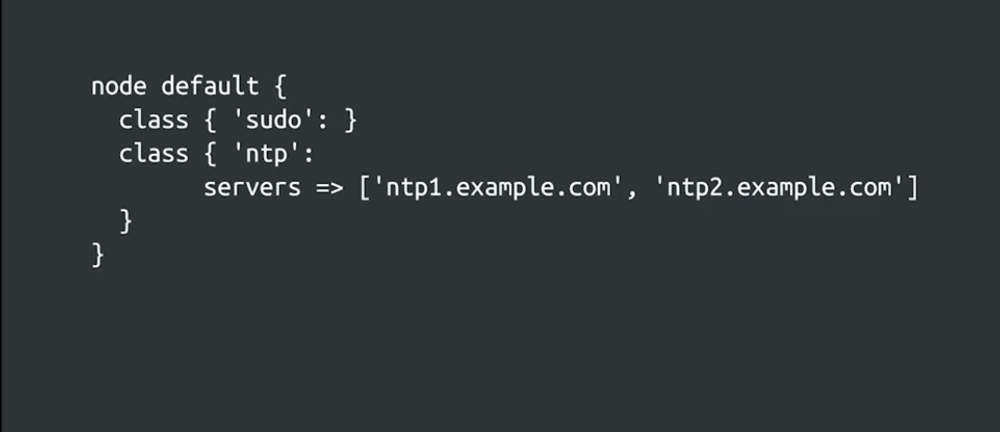
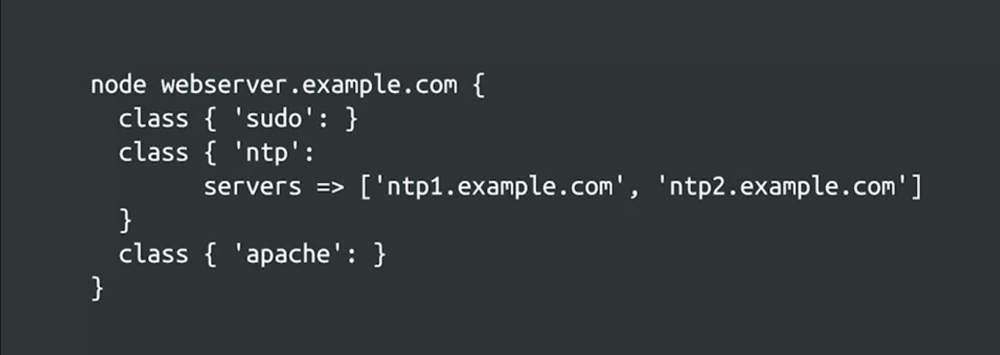
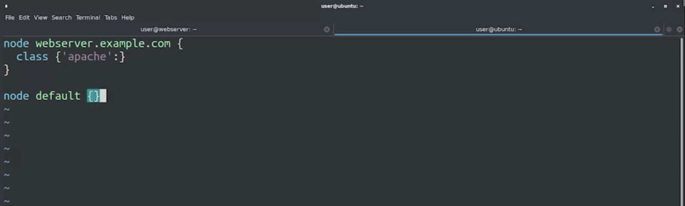
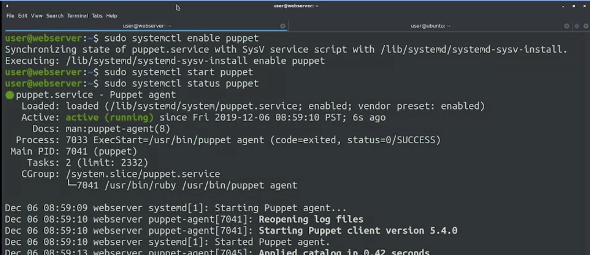
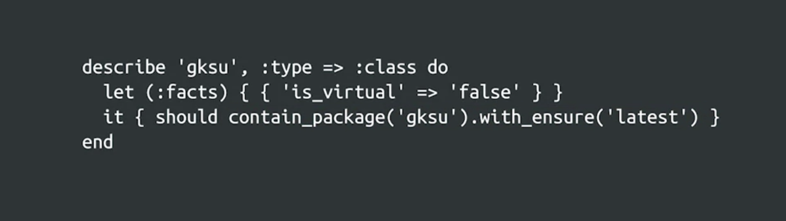

# Deploying Puppet

---

## Deploying Puppet Locally

### Applying Rules Locally

* **Puppet Syntax**: Understanding the syntax and different resources available in Puppet.

* **Deployment**: Puppet is typically deployed in a client-server architecture but can also be used stand-alone.

#### Stand-Alone Puppet

* **Usage**: Common for testing new configurations or in complex setups where connecting to a master is not ideal.

* **Process**: In stand-alone mode, the same computer processes facts, calculates rules, and makes changes locally.

#### Installing Puppet

* **Platforms**: Puppet is available on various platforms.

* **Installation Methods**:

  * Package management system in the OS.

  * Direct download from the official website.

* **Example**: Using `sudo apt install puppet-master` to install Puppet on Ubuntu.

#### Creating Puppet Rules

* **Manifest Files**: Rules are stored in files called manifests, with a `.pp` extension.

* **Example Task**: Ensuring that debugging tools (like `htop`) are installed on each computer.

#### Creating a Manifest File

* **File Name**: `tools.pp`

* **Resource**: Package resource for `htop`.

* **Operation**: Ensure the `htop` package is present on the computer.

#### Applying Puppet Rules

* **Command**: `sudo puppet apply -v tools.pp`

  * `-v` flag for verbose output.

* **Process**:

  * Loading facts.

  * Compiling a catalog.

  * Applying configuration.

  * Installing requested packages.

  * Completing catalog application.

#### Understanding Puppet Catalog

* **Catalog**: A list of rules generated for a specific computer after evaluating variables, conditionals, and functions.

* **Behavior**: In simple cases, the catalog matches the code. In complex cases, it varies based on fact values.

#### Verifying Rule Application

* **Testing**: Run the `htop` command to verify installation.

* **Reapplication**: Puppet recognizes already installed packages and skips reinstallation.

### Managing Resource Relationships

#### Overview

* **Previous Video**: Created and applied a simple manifest locally.

* **Focus**: Exploring more complex Puppet manifest configurations.

#### Resource Relationships in Puppet

* **Manifest Example**: `ntp.pp`, managing NTP (Network Time Protocol) configuration.
    

* **Resource Relationships**:

  * Configuration file requires the NTP package.

  * Service requires the configuration file.

  * Service should be notified if the configuration file changes.

#### Syntax Nuances

* **Resource Types**: Written in lowercase when declared.

* **Relationships**: Use uppercase for the first letter (e.g., Require, Notify).

* **Understanding**: It may initially be confusing but becomes clearer with practice.

#### Puppet Classes

* **Usage**: To apply rules described in a class.

* **Example**: `include NTP` at the bottom of the file.

* **Typical Practice**: Defining the class in one file and including it in another.

#### Applying the Manifest

* **Process**:

  * Install the package.

  * Update the configuration file as needed.

  * Restart the NTP service after configuration changes.

#### Editing and Applying Configuration Changes

* **Task**: Changing NTP servers to Google's (e.g., `time1.google.com`).

* **Steps**:

  * Edit `ntp.conf` file.

  * Rerun Puppet rules with the updated configuration.

#### Results and Next Steps

* **Outcome**: Puppet successfully updates the configuration file and refreshes the service.

* **Next Topic**: Utilizing Puppet modules to organize and separate related operations.

#### More Information About Deploying Puppet Locally

Check out the following links for more information:

* <https://puppet.com/docs/puppet/latest/style_guide.html>

* <https://puppet.com/docs/puppetserver/latest/install_from_packages.html>

---

## Deploying Puppet to Clients

### Puppet Nodes

* Any system where `puppet agent` can be run

* **Objective**: Apply some rules universally to all computers, and others only to specific subsets.

#### Example Scenario

* **General Rule**: Install a basic set of tools on all servers.
* **Specific Rules**:
  * Web servers: Install packages for serving web pages.
  * Mail servers: Install packages for sending and receiving email.

#### Methods to Apply Different Rules

1. **Using Facts**: Apply rules conditionally based on facts from the machines.
2. **Node Definitions**: Apply specific rules to different systems using separate node definitions.

#### Definition of a Node in Puppet

* **Node**: Any system where a Puppet agent can run (e.g., workstation, server, virtual machine, network router).

#### Setting Up Node-Specific Rules

* **Default Node Definition**: Lists classes to be included for all nodes.
  * Example: Include `sudo` and `ntp` classes for all nodes.
  * Additional Parameters: Setting parameters like `servers` for the `ntp` class.

#### Defining Specific Nodes

* **Identification**: Specific nodes identified by their Fully Qualified Domain Names (FQDNs).
* **Example**: Node definition for `webserver.example.com` includes `sudo`, `ntp`, and `apache` classes.
* **Inheritance**: Default node definitions apply only to nodes without explicit entries.
* **Efficiency**: Define a base class to include common classes for all node types.

#### Storage of Node Definitions

* **File**: `site.pp`
* **Location**: Not part of any module, but defines class inclusions for different nodes.
* **Purpose**: Organizes code for easier maintenance.

### Puppet's Certificate Infrastructure

#### Overview

* **Typical Deployment**: Managed machines in a fleet connect to a Puppet server, exchanging facts and catalogs.
* **Challenge**: Ensuring the server trusts the client's identity.

#### Introduction to PKI and SSL in Puppet

* **PKI (Public Key Infrastructure)**: Used by Puppet for secure connections.
* **SSL (Secure Sockets Layer)**: Encrypts communication, verifying server and client identities.

#### Key Mechanics

* **Key Pairs**: Each machine has a private key (secret) and a public key (shared).
* **Validation Process**: Messages are signed with the private key and validated with the public key.
* **Certificate Authority (CA)**: Validates machine identities and issues certificates linking public keys with machines.

#### Puppet's Certificate Authority

* **Built-In CA**: Puppet includes its own CA for client certificates.
* **Integration**: Possible to integrate Puppet with an existing company CA.

#### Certificate Issuance and Validation

* **First-Time Check-In**: Node requests a certificate from the Puppet master.
* **Identity Verification**: Manually by system administrator or automatically using pre-validated information.
* **Importance of Identity Verification**: Ensures confidentiality and correctness of Puppet rules application.

#### Authentication Strategies

* **Manual Signing**: Common in initial setups; administrators manually verify and sign certificate requests.
* **Automated Verification**: Necessary for large fleets; uses scripts and pre-shared data for identity confirmation.

#### Why Verify Node Identity?

* **Security**: Protects confidential information in Puppet rules.
* **Integrity**: Ensures machines receive the correct configuration.
* **Risks**: Avoids incorrect setups and security breaches from rogue machines.

### Setting up Puppet Clients and Servers

#### Setting Up the Puppet Master

* **Initial Setup**: Installed the Puppet master package on a test machine.

* **Auto-sign Configuration**: Set `auto sign` to `true` for test deployment. Note: For real deployments, manually sign requests or use a validation script. `sudo puppet config --section master set autosign true`

#### Setting Up the Puppet Client

* **Connection to Puppet Master**: Configured using `Puppet config` to set the server to `ubuntu.example.com`.

* **Testing Connection**: Used `Puppet agent -v --test` to check the connection.
* **Process**:
  * SSL key creation for the machine.
  * Certificate request generation and fingerprint display.
  * Automatic certificate generation on the master and local storage on the client.

#### Applying Configurations

* **Catalog Exchange**: Client received a catalog from the master and applied it.

* **No Rules Yet**: No specific rules configured for the clients at this stage.

#### Creating Node Definitions

* **File**: `site.pp` located in `/etc/puppet/code/environments/production/manifests`.

* **Content**: Node definition for the web server to install Apache.
* **Default Node**: An empty default node definition added, for future expansion.

#### Running the Puppet Agent

* **Installation and Configuration**: Applied the catalog from the master to install and configure Apache.

* **Service Management**: Enabled and started the Puppet service using `systemctl` for automatic runs.

#### Keeping Puppet Updated

* **Automatic Runs**: Puppet agent set to check regularly with the master for updates.

* **Maintaining Configuration**: Ensures ongoing alignment with the master's configurations.

#### Conclusion

* **Server-Client Model**: Demonstrated Puppet's ability to manage software installation and configuration.

* **Power of Configuration Management**: Introduction to the basics of Puppet configuration.

#### Next Steps

* More information on client-server setup and a quiz to reinforce learning.

#### More Information about Deploying Puppet to Clients

Check out the following link for more information:

* <http://www.masterzen.fr/2010/11/14/puppet-ssl-explained/>

---

## Updating Deployments

### Modifying and Testing Manifests

#### Power of Puppet

* **Change Management**: Small changes in manifests can modify all machines in the fleet.

* **Responsibility**: With the power to make widespread changes comes the need for careful testing and responsible deployment.

#### Testing Manifests

* **Common Approach**: Testing new rules on local machines.

* **Risks**: Potential to lock out or cause issues on testing machine.

#### Safe Testing Strategies

1. **Syntax Validation**: Using `puppet parser validate` to check manifest syntax.
2. **Simulation Mode**: Running Puppet with `--noop` to simulate changes without applying them.

#### Limitations of Manual Testing

* **Complex Changes**: Difficult to catch all aspects of complex changes.

* **Test Machines**: Using dedicated machines for testing, but this can still miss crucial checks.

#### Automated Testing with R-Spec

* **R-Spec Tests**: Automatically test manifests by setting different facts and verifying the resulting catalog.

* **Example**: Setting `is_virtual` to `false` and checking if a specific package is correctly included.
  

#### Ensuring Effective Rule Application

* **Catalog Checks**: Verify that the catalog contains the intended rules.

* **Node Application Checks**: Apply rules on test nodes and validate the results.

#### Automating Node Application Testing

* **Test Machines**: First apply the catalog to test machines.

* **Validation Scripts**: Use scripts to confirm correct behavior.

#### Deploying Changes to the Fleet

* **Safe Deployment**: Strategies for safely pushing changes to the entire fleet.

* **Upcoming Video**: Detailed look into deploying changes across the fleet.

### Rolling Out Changes in Puppet Deployments

#### Understanding Production Environment

* **Production Servers**: Essential servers that deliver services to users, like website content or password validation.

#### Safe Deployment Strategies

1. **Test Environment**: Machines with the same configuration as production but not serving users.
   * Identifies problems before affecting actual users.
2. **Puppet Environments**: Isolates configurations for agents based on the environment they're running in.
   * Example: Testing a new version of the Apache module in a test environment while keeping the old version in production.

#### Creating Multiple Environments

* **Purpose**: Allows testing of new Puppet rules or specific features in isolated settings.

* **Examples**: Development environment, feature-specific testing environment.

#### Deployment Process

1. **Initial Rollout**: Push changes to test environment machines first.
2. **Verification**: Includes both manual checks and automated testing.
3. **Gradual Deployment**: Roll out changes in batches rather than all at once.

#### Using Canary Nodes

* **Concept**: Deploy changes to a subset of machines (canaries) first to detect potential issues.

* **Advantages**: Limits impact of unforeseen issues and facilitates easier rollback.

#### Best Practices for Changes

* **Small and Self-contained Changes**: Simplifies troubleshooting and issue identification.

* **Frequent Rollouts**: Preferably every one or two weeks to minimize the scope of potential problems.

#### Advancing Testing and Deployment Practices

* **Improvements Over Time**: Enhance automated testing and expand the testing environment as the fleet grows.

* **Gradual Implementation**: Start small and incrementally improve practices.
