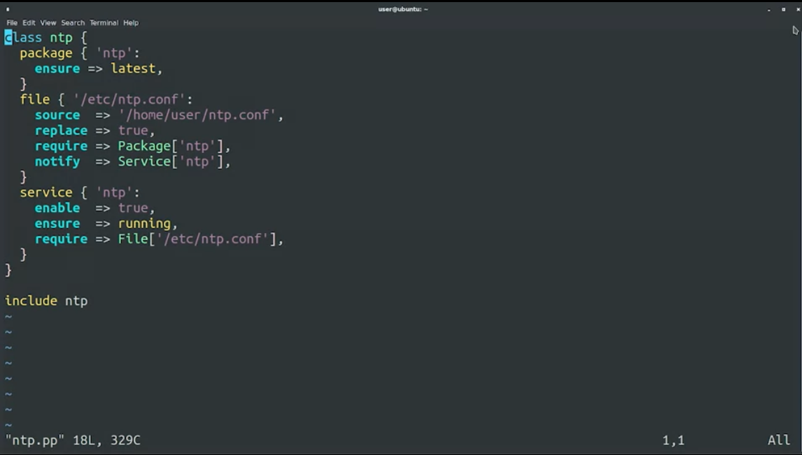

# Deploying Puppet

## Deploying Puppet Locally

### Applying Rules Locally

- **Puppet Syntax**: Understanding the syntax and different resources available in Puppet.
- **Deployment**: Puppet is typically deployed in a client-server architecture but can also be used stand-alone.

## Stand-Alone Puppet

- **Usage**: Common for testing new configurations or in complex setups where connecting to a master is not ideal.
- **Process**: In stand-alone mode, the same computer processes facts, calculates rules, and makes changes locally.

## Installing Puppet

- **Platforms**: Puppet is available on various platforms.
- **Installation Methods**:
  - Package management system in the OS.
  - Direct download from the official website.
- **Example**: Using `sudo apt install puppet-master` to install Puppet on Ubuntu.

## Creating Puppet Rules

- **Manifest Files**: Rules are stored in files called manifests, with a `.pp` extension.
- **Example Task**: Ensuring that debugging tools (like `htop`) are installed on each computer.

### Creating a Manifest File

- **File Name**: `tools.pp`
- **Resource**: Package resource for `htop`.
- **Operation**: Ensure the `htop` package is present on the computer.

### Applying Puppet Rules

- **Command**: `sudo puppet apply -v tools.pp`
  - `-v` flag for verbose output.
- **Process**:
  - Loading facts.
  - Compiling a catalog.
  - Applying configuration.
  - Installing requested packages.
  - Completing catalog application.

### Understanding Puppet Catalog

- **Catalog**: A list of rules generated for a specific computer after evaluating variables, conditionals, and functions.
- **Behavior**: In simple cases, the catalog matches the code. In complex cases, it varies based on fact values.

### Verifying Rule Application

- **Testing**: Run the `htop` command to verify installation.
- **Reapplication**: Puppet recognizes already installed packages and skips reinstallation.

### Upcoming Topics

- Managing relationships between different Puppet resources.
- Practical application of these relationships.

## Managing Resource Relationships

### Overview

- **Previous Video**: Created and applied a simple manifest locally.
- **Focus**: Exploring more complex Puppet manifest configurations.

### Resource Relationships in Puppet

- **Manifest Example**: `ntp.pp`, managing NTP (Network Time Protocol) configuration.

- **Resource Relationships**:
  - Configuration file requires the NTP package.
  - Service requires the configuration file.
  - Service should be notified if the configuration file changes.

#### Syntax Nuances

- **Resource Types**: Written in lowercase when declared.
- **Relationships**: Use uppercase for the first letter (e.g., Require, Notify).
- **Understanding**: It may initially be confusing but becomes clearer with practice.

### Puppet Classes

- **Usage**: To apply rules described in a class.
- **Example**: `include NTP` at the bottom of the file.
- **Typical Practice**: Defining the class in one file and including it in another.

### Applying the Manifest

- **Process**:
  - Install the package.
  - Update the configuration file as needed.
  - Restart the NTP service after configuration changes.

### Editing and Applying Configuration Changes

- **Task**: Changing NTP servers to Google's (e.g., `time1.google.com`).
- **Steps**:
  - Edit `ntp.conf` file.
  - Rerun Puppet rules with the updated configuration.

### Results and Next Steps

- **Outcome**: Puppet successfully updates the configuration file and refreshes the service.
- **Next Topic**: Utilizing Puppet modules to organize and separate related operations.

