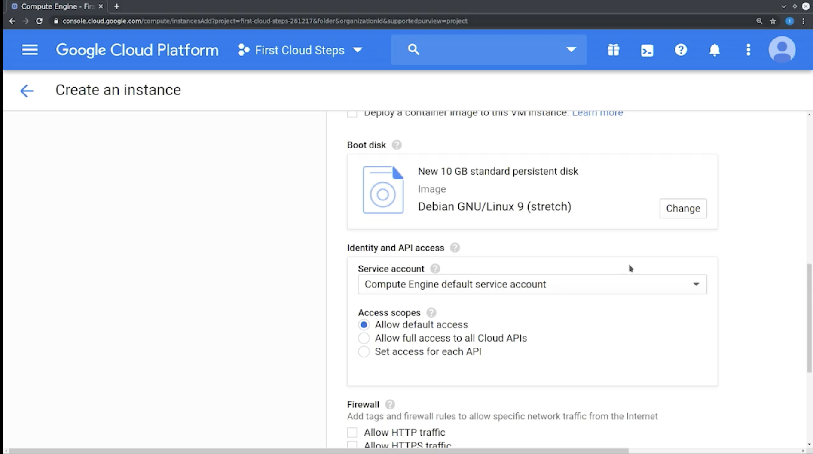
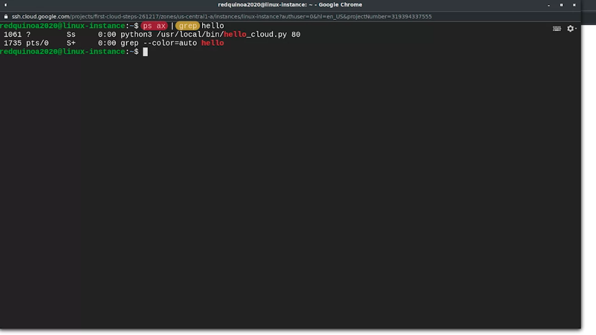

# Automation in the Cloud

## Cloud Computing

### Cloud Services Overview

#### Defining "Cloud Services"

- **Cloud Services**: Services running remotely in data centers or on servers accessible over the Internet.
- **Variety of Machines**: Data centers house diverse machines, like those with SSDs for performance or virtual drives for cost efficiency.

#### Types of Cloud Services

1. **Software as a Service (SaaS)**:
   - Complete applications delivered by cloud providers (e.g., Gmail, Dropbox, Microsoft Office 365).
   - Minimal customization options; provider manages hosting, capacity, backups, etc.

2. **Platform as a Service (PaaS)**:
   - Preconfigured platforms offered by cloud providers.
   - Example: SQL database as a service, freeing users from installation and maintenance tasks.

3. **Infrastructure as a Service (IaaS)**:
   - Provides bare-bones computing experience, typically virtual machines and networking components.
   - High control level; users manage their software and configurations.
   - Popular IaaS examples: Amazon EC2, Google Compute Engine, Microsoft Azure Compute.

#### Cloud Regions and Zones

- **Regions**: Geographical locations with multiple data centers.◊
- **Zones**: Contain one or more data centers within a region.
- **Service Migration**: In case of a data center failure, services can be moved to other zones.
- **Choice Criteria**:
  - Proximity to users to reduce latency.
  - Legal or policy requirements for data storage locations.
  - Proximity to service dependencies.

#### Case Example: Qwiklabs

- **Service Model**: Uses Infrastructure as a Service (IaaS).
- **Deployment**: VMs provisioned with OS, and lab automation deploys additional software.

### Scaling in the Cloud

#### Traditional IT vs. Cloud Scaling

- **Traditional IT**: Scaling involves buying hardware, installing software, and integrating with infrastructure.
- **Cloud Scaling**: Easier and quicker to scale up or down based on service usage.

#### Understanding Capacity

- **Definition**: Capacity refers to how much a service can deliver.
- **Measurement**: Depends on the system's purpose (e.g., disk space for storage, queries per second for web servers).
- **Change Over Time**: Capacity needs can increase or decrease, leading to scaling.

#### Types of Cloud Scaling

1. **Horizontal Scaling**:
   - Adding more nodes to a service pool.
   - Example: Using multiple Apache web servers to increase concurrent connections.

2. **Vertical Scaling**:
   - Enhancing the resources of existing nodes (memory, CPU, disk space).
   - Example: Increasing disk space on a database server or memory on a caching server.

#### Deployment Modification

- **Cloud vs. On-Premise**: In the cloud, scaling is done through a web UI or configuration management system instead of physical hardware changes.

#### Automatic vs. Manual Scaling

- **Automatic Scaling**:
  - Uses metrics to adjust capacity based on demand.
  - Example: Scaling cat video service based on viewer demand.
  - Risk: Potential for high costs if not capped.
  
- **Manual Scaling**:
  - Controlled by humans, suitable for less complex or smaller-scale deployments.
  - Example: Adding a mail server based on projected growth.
  - Risk: Without monitoring, unexpected demand can lead to performance issues or outages.

#### Cloud Benefits and Challenges

- **Benefits**: Flexibility and ease of scaling.
- **Intimidation Factor**: Complexity and new concepts can be daunting.
- **Next Topic**: Addressing hesitations about migrating to the cloud and overcoming related challenges.

### Evaluating the Cloud

#### Traditional IT vs. Cloud

- **Control in Traditional IT**: Full control over hardware, software, and network.
- **Shifting Control in Cloud**: In cloud solutions, some control is relinquished to the cloud provider.

#### Service Models and Control Levels

1. **Software as a Service (SaaS)**: Limited control; provider manages the application.
2. **Platform as a Service (PaaS)**: Control over code, but not application running.
3. **Infrastructure as a Service (IaaS)**: High level of control over OS, applications.

#### Vendor Dependency

- **Support Requirements**: Dependency on vendor support for some issues.
- **Selecting Providers**: Importance of choosing providers with suitable support and service levels.

#### Concerns with Cloud Migration

- **Hardware and Network Management**: Reluctance to give up control over these aspects.
- **Security Considerations**:
  - Verifying provider's security measures (certifications like SOC 1, ISO 27001).
  - User responsibility for security (e.g., strong passwords, firewalls).

#### Implementing Security in the Cloud

- **Shared Responsibility**: Both cloud providers and users play a role in security.
- **Cost vs. Security**: Balancing specialized security measures with implementation costs.
- **Data Sensitivity**: Tailoring security practices to the sensitivity of the data.

#### Other Cloud Concerns

- **Data Storage Location**: Concerns about where data is stored geographically.
- **Support Quality**: Potential worries about the adequacy of provider support.

#### Preparing for Cloud Migration

- **Understanding Terms of Service**: Essential to comprehend the conditions and services offered.
- **Risk Management**: Preparing with appropriate security measures.

#### Next Steps

- Detailed exploration of cloud migration processes in the upcoming video.

### Migrating to the Cloud

#### Migration Considerations

- **Trade-off**: Balancing control over computers with the effort required for maintenance.
- **Goals**: Determining the objectives of migrating to a cloud provider.

#### Infrastructure as a Service (IaaS)

- **Control and Flexibility**: High control over infrastructure design, choice of machine types, and storage.
- **Use Case**: Ideal for administrators using a 'lift and shift' strategy.

#### Lift and Shift Strategy

- **Concept**: Migrating physical servers to virtual machines in the cloud.
- **Core Configurations**: Remain the same, whether hosted on-site or in the cloud.
- **Configuration Management**: Existing tools can be applied to VMs in the cloud for easy setup replication.

#### Platform as a Service (PaaS)

- **Management Ease**: Focus on using the platform rather than day-to-day management (e.g., SQL databases, web applications).
- **Examples**: Amazon Elastic Beanstalk, Microsoft App Service, Google App Engine.

#### Containers

- **Portability**: Packaged applications with configuration and dependencies, consistent across environments.
- **Flexibility**: Easy migration between on-premise servers and various cloud providers.

#### Types of Cloud Environments

1. **Public Cloud**: Services provided by third parties to the public.
2. **Private Cloud**: Company-owned services, whether on-site or remote.
3. **Hybrid Cloud**: Mix of public and private clouds, integrated for seamless data access and management.
4. **Multi-Cloud**: Combines multiple public and/or private clouds across vendors.
   - Hybrid Cloud is a type of Multi-Cloud.
   - Benefits: Extra protection through vendor diversification.

#### Upcoming Topics

- Quiz on cloud infrastructure and services concepts.
- Practical aspects of using cloud infrastructure.

---

## Managing Instances in the Cloud

#### Spinning Up VMs in the Cloud

- **Focus**: Demonstrating practical actions on the cloud using Google Cloud Platform.
- **Cloud Consoles**: Management platforms for cloud services, initially overwhelming but essential to understand.

#### Setting Up a Virtual Machine (VM)

- **Parameters**: Key settings for configuring VMs in the cloud.
- **Instance Naming**: Selecting a unique name for identification and management.
- **Region and Zone Selection**: Choosing based on proximity to users for performance optimization.
- **Machine Type Configuration**: Balancing processing units, memory allocation, and cost considerations.
- **Boot Disk Selection**: Determining disk space and operating system for the VM.

#### Deployment Methods

- **Web Interface**: Useful for exploring options and cost estimation, but less scalable.
- **Command Line Interface (CLI)**: Enables automation and script-based management, ideal for scaling and replication.

#### Automation and Templating

- **Reference Images**: Storing machine contents in a reusable format.
- **Templating Process**: Capturing system configuration for repeatable VM creation.
- **Disk Image**: A snapshot of a VM's disk at a specific point in time, essential for templating.

#### Upcoming Demonstrations

- Creating new VMs on Google Cloud Console.
- Customizing VMs and using templating and reference images for automation.

### Creating and Configuring a Virtual Machine on Google Cloud Platform (GCP)

- **Cloud Console Access**: Navigate to console.cloud.google.com.
- **Project Creation**: Start by creating a project, such as 'First Cloud Steps', to associate VMs with.

#### Creating a Virtual Machine

- **Compute Engine**: Go to the Compute Engine menu and select VM instances.
- **Create VM**: Click the Create button to start configuring a new VM.

#### VM Configuration Options

- **Naming the VM**: Assign a unique name, e.g., 'linux-instance'.
- **Region and Zone**: Select based on proximity to users for better performance.

- **Machine Type**: Choose between general-purpose and memory-optimized, and select CPU/memory specifications.
- **Boot Disk**: Decide on disk size and operating system, like Ubuntu.

#### Advanced Configuration

- **Disk Type**: Choose between standard disks or faster SSDs.
- **Remote Access**: Default access option allows remote SSH access.
- **Firewall Rules**: Pre-configure firewall settings, like enabling HTTP traffic.
- **Additional Settings**: Explore more options for advanced customization.

#### Command Line Interface (CLI) Option

- **Generating CLI Command**: View the CLI command equivalent for the selected VM options.
- **Command Copying**: Use the command to replicate VM creation.

#### Finalizing VM Creation

- **Creating the VM**: Click the Create button to initiate VM setup.
- **Resource Allocation**: The system assigns resources, deploys the OS, and sets up network interfaces.
- **SSH Access**: Connect to the newly created VM using SSH.

#### Post-Creation Actions

- **OS Verification**: Confirm the VM is running the selected operating system.

- **Normal Linux Operations**: Treat the VM like any standard Linux machine.
- **Example Command**: Use `curl` to access web pages from the command line. `curl wttr.in`

### Customizing VMs in GCP

#### Preparing for Scalable Deployment

- **Objective**: Configuring a VM to use as a base for a reference image, enabling scalable services.
- **Tools Used**: Git for cloning repositories, Python for running web applications.

#### Setting Up a Web Serving Application

- **Application Deployment**: Cloning a repository with a simple web serving application.
- **Port Configuration**: Adjusting the application to listen on the HTTP port (port 80) with admin privileges.

#### Accessing the Web Application

- **Firewall Configuration**: Allowing HTTP traffic to reach the VM.
- **Testing**: Verifying the application outputs (e.g., 'Hello Cloud', hostname, IP address).

#### Automating Application Startup

- **Service Configuration**: Using a systemd service file to ensure the app starts automatically.

- **File Locations**: Moving script to `/usr/local/bin` and service file to `/etc/systemd/system`.
- **Enabling the Service**: Using the `systemctl` command to enable automatic startup.

#### Validating Automatic Startup

- **Reboot Test**: Rebooting the VM to confirm the app starts automatically.
- **Process Verification**: Using `ps ax` and `grep` commands to verify the application is running.

#### Upgrading the Web Application

- **Options for Upgrades**:
  1. Creating a new reference image for each app version.
  2. Using a configuration management system for post-creation changes.

#### Integrating Puppet for Configuration Management

- **Puppet Client Installation**: Preparing the VM for future updates via Puppet.
- `sudo apt install puppet`
- **Automating Puppet Setup**: Running a script for initial configuration and setting Puppet to run at boot.

### Templating a Customized VM

#### Creating a Reference Image

- **Initial Step**: Stop the VM to access its virtual disk.
- **Creating an Image**: Make a snapshot or an image of the disk for templating.

#### Naming and Setting Image Details

- **Image Name**: Example name, 'webserver-image'.
- **Base Disk Selection**: Choose the Linux-instance disk.
- **Default Settings**: Keeping most settings as default for the image creation.

#### Creating an Instance Template

- **Accessing Template Options**: Go to the instance template menu and create a new template.
- **Template Configuration**: Name the template (e.g., 'webserver-template'), select the custom image, and enable HTTP access.

#### Deploying Instances from Template

- **Creating Instances**: Use the template to create new VMs.
- **Simplified Process**: Pre-selected values in the template streamline VM creation.
- **Example**: 'webserver-one' instance is created without additional configuration.

#### Command Line Interface for Batch Actions

- **Using gcloud Command**: Authenticate and set up default project, region, and zone.

- **Batch VM Creation**: Create multiple VMs (e.g., ws1 to ws5) using a single command.
- **Efficiency**: Faster and easier than using the web interface.

#### Summarizing the Process

- **Steps Covered**: From creating a single VM, customizing it, creating a template, to deploying multiple identical VMs.
- **Practical Application**: Demonstrates the efficiency and scalability of cloud deployments.

#### Upcoming Content

- Additional information on the tools demonstrated and a quiz to reinforce learning.

#### Managing VMs in GCP

Over the last few videos we learned how to create and use virtual machines running on GCP. We then explored how we can use one VM as a template for creating many more VMs with the same setup. You can find a lot more information about this in the following tutorials:

- *<https://cloud.google.com/compute/docs/quickstart-linux>*
- *<https://cloud.google.com/compute/docs/instances/create-vm-from-instance-template>*
- *<https://cloud.google.com/sdk/docs>*

---

## Automating Cloud Deployments

### Scaling and Load Balancing in Cloud Services

#### Key Features of Cloud Services

- **Scalability**: Ability to easily scale services up or down.
- **Preparation**: Setting up services for easy capacity increase by adding more nodes.

#### Load Balancing

- **Purpose**: Ensures balanced request distribution across nodes.
- **Strategies**: Various methods like round-robin, origin-based, proximity-based, and load-based selection.

#### Autoscaling

- **Functionality**: Automatically increases or decreases capacity based on demand.
- **Cost Efficiency**: Pay only for the resources in use at any given time.
- **Ephemeral Nodes**: Nodes and local disks are short-lived; data persistence requires separate storage resources.

#### Database Integration

- **Cloud-Based Databases**: Multiple nodes managed by Cloud provider, usually under a Platform as a Service model.

#### Example: Large Web Application

- **User Connection**: Retrieval of website IP address leading to an entry point.
- **Scaling**: Multiple entry points for reliability and latency reduction.
- **Layers**: Includes web caching servers, actual web services, and additional database caching.

#### Caching Mechanisms

- **Web Caching Servers**: Applications like Varnish, Nginx, or services like Cloudflare and Fastly.
- **Database Caching**: Uses applications like Memcached or Redis for quick data retrieval.

#### Handling Complex Deployments

- **Infrastructure Management**: Cloud provider automates instance management, load distribution, and regional capacity adjustments.

### What is Orchestration

### Automation and Orchestration in Cloud Computing

#### Overview of Automation

- **Definition**: Automation replaces manual steps with automatic processes.
- **Cloud Instance Creation**: Templating, command line tools, and auto-scaling for automated instance creation.

#### Importance of Orchestration

- **Orchestration**: Automated configuration and coordination of complex IT systems and services.
- **Purpose**: Ensures that automated tasks and systems interact correctly and cohesively.

#### Example: Website Infrastructure Deployment

- **Scenario**: Deploying a new website infrastructure in a separate data center.
- **Needs**: Automating configuration of instance types, network setup, and system interactions.

#### Implementing Orchestration

- **Repeatable Configuration**: Essential for effective orchestration.
- **Tools**: Utilize APIs to interact directly with cloud infrastructure for system setup and management.
- **Flexibility**: Orchestration via programming provides flexibility in deploying complex setups.

#### Cloud Provider APIs

- **Functionality**: Perform tasks like creating, modifying, deleting instances, and deploying configurations.
- **Hybrid Cloud Setups**: Orchestrating services in both cloud and on-premise environments.

#### Monitoring and Alerting

- **Necessity**: Critical for detecting and addressing service issues.
- **Orchestration Role**: Automates the setup of monitoring and alerting across deployments.

### Cloud as Infrastructure as Code

#### Complex Cloud Setups and Orchestration

- **Challenges**: Managing various nodes, hybrid setups, and deployments across multiple data centers.
- **Orchestration Role**: Handles coordination and configuration of complex cloud systems.

#### Infrastructure as Code

- **Principles**: Storing infrastructure in a code-like format for repeatability and using version control for tracking changes.
- **Advantages**: Facilitates management of large-scale solutions, allows quick adjustments, and provides a clear history of changes.

#### Cloud Provider-Specific Tools

- **Examples**:
  - Amazon's Cloud Formation.
  - Google's Cloud Deployment Manager.
  - Microsoft's Azure Resource Manager.
  - OpenStack's Heat Orchestration Templates.
- **Limitation**: Provider-specific tools can complicate migrations or hybrid deployments.

#### Terraform for Orchestration

- **Functionality**: Uses a domain-specific language for defining cloud infrastructure.
- **Flexibility**: Compatible with various cloud providers, simplifying migrations and hybrid setups.
- **Operation**: Interacts with cloud providers' APIs, focusing on infrastructure design rather than provider-specific APIs.

#### Puppet Integration

- **Capability**: Puppet plugins can create and modify cloud infrastructure across different cloud providers.

#### Managing Node Contents

- **Long-lived Instances**: Updated using configuration management systems like Puppet for continuous updates.
- **Short-lived Instances**: Configured at startup; future changes are made by deploying new instances.

#### Learning and Application

- **Complexity**: Acknowledgment of the complexity in cloud orchestration.
- **Exploration**: Encouragement to try out these concepts for better understanding.

#### More About Cloud & GCP

Check out the following links for more information:

- *[Getting started on GCP with Terraform](https://cloud.google.com/community/tutorials/getting-started-on-gcp-with-terraform)*
- *[Creating groups of unmanaged instances](https://cloud.google.com/compute/docs/instance-groups/creating-groups-of-unmanaged-instances)*
- Official documentation is here: https://cloud.google.com/load-balancing/docs/https/
- https://geekflare.com/gcp-load-balancer/

Interesting articles about hybrid setups:

- https://blog.inkubate.io/create-a-centos-7-terraform-template-for-vmware-vsphere/
- https://www.terraform.io/docs/enterprise/before-installing/reference-architecture/gcp.html
- https://www.hashicorp.com/resources/terraform-on-premises-hybrid-cloud-wayfair

