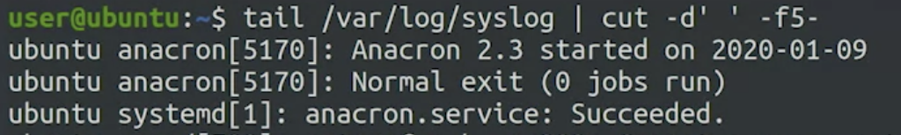

# Advanced Command Interaction

```bash
tail /var/log/syslog
```


---

`cut` let's us take bits of each line using a field delimiter

```bash
tail /var/log/syslog | cut -d' ' -f5-
```

`-d` signifies use of delimiter

`-f5-` print field number 5 and everything after. Remove date and name of computer. Keeping process and name of computer.



---

```bash
cut -d' ' -f5- /var/log/systlog | sort | uniq -c | sort -nr | head -5
```


---

```bash
for logfile in /var/log/*log; do
    echo "Processing: $logfile"
    cut -d' ' -f5- /var/log/systlog | sort | uniq -c | sort -nr | head -5
done
```

