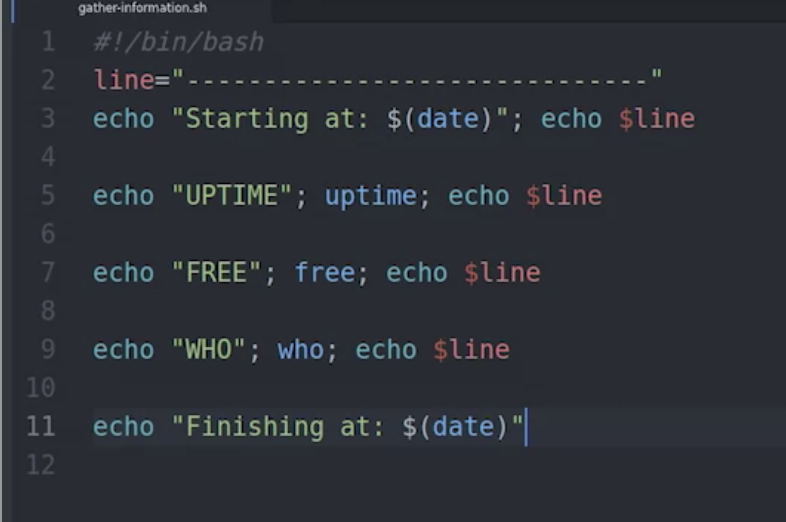
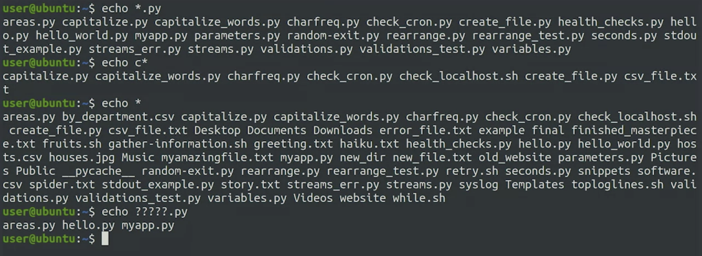

# Creating Bash Scripts


## .sh file extension

```bash
echo "starting at: $(date)"
echo

echo "UPTIME"
uptime
echo

echo "FREE"
free
echo

echo "WHO"
who
echo

echo "Finishing at: $(date)"
```

```bash
echo "starting at: $(date)";echo

echo "UPTIME";uptime;echo

echo "FREE";free;echo

echo "WHO";who;echo

echo "Finishing at: $(date)"
```

---

## Using Variables and Globs

```bash
example=hello #note no spaces
echo $example
#this stays within current terminal / environment where it is defined.
```



---

**Globs** creates squences of filenames

```bash
echo *.py

echo c*
```



---

