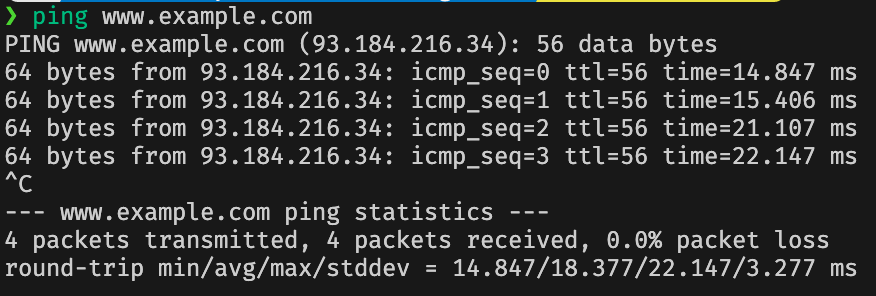
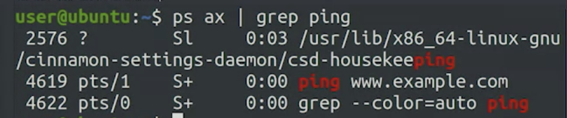

# Signalling Processes

**Tokens** delivered to running processes to indicate a desired action.

---

## SIGINT

`ctrl+c` - interrupt

---

## SIGSTOP

`ctrl+z` suspend
`fg` continues

---

## SIGTERM

`kill`

Needs PID of process to send signal to.

`ps` list running processes.

`ps ax` all processes in computer

`ps ax | grep ping` 

