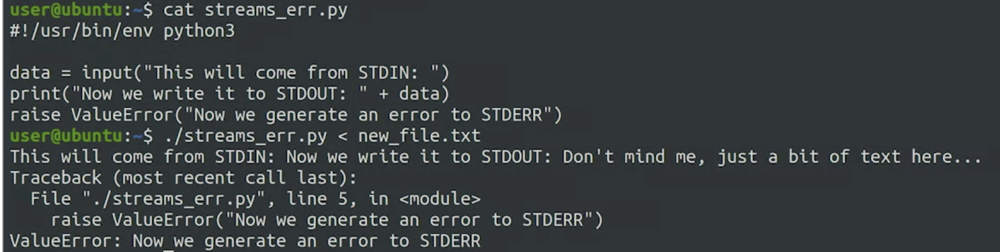
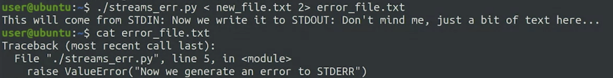

# Streams

## Write

```bash
./stdout_example.py > new_file.txt
```

Each time we perform a redirection of STDOUT, the file is overwritten.

---
## Append

```bash
./stdout_example.py >> new_file.txt
```

---
## Input



```bash
./calculator.py < result.txt
```

---
## Stderr



```bash
./streams_err.py <new_file.txt 2> error_file.txt
```

2 is a file descriptor of stderr.
0 & 1 are for stdin and out.
File descriptor is like a variable pointing to and IO resource.

