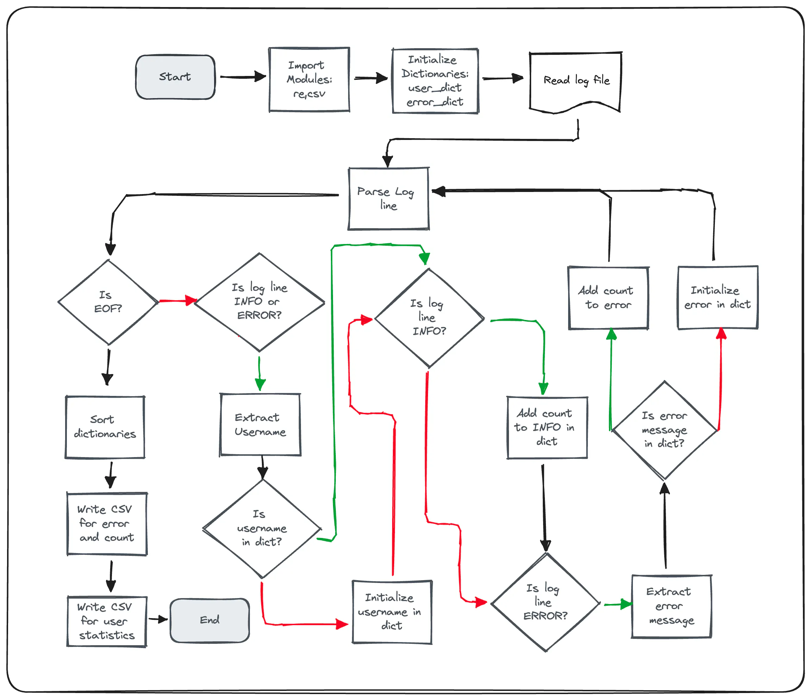
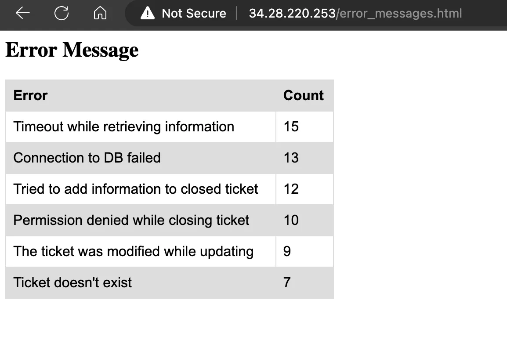
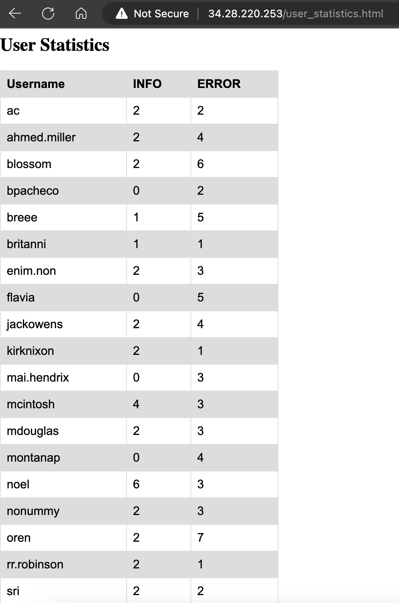

# Automating Log Analysis and Reporting for Service Insights: A Python-based Approach

*Utilizing Python, Regex, and File Operations to Enhance Ticky's Internal Ticketing System*

**Original blog [here](https://dkloud.hashnode.dev/automating-log-analysis-and-reporting-for-service-insights-a-python-based-approach).**

## **Brief**

Ticky, an internal ticketing system of a fictional company, generates usage logs. The company would like to understand how the service is being used in order to improve it. Inspecting the logs manually is tedious and time-consuming. Thus, reports are generated from the log file to help stakeholders quickly draw insights from the logs. Python is used to extract and organize information that is useable to other stakeholders in the company.

> Skills and Tech: `python` `regex` `dictionaries` `working with files` `linux` `documentation`
> Concepts learned and reinforced: **Analysis of a stakeholder operational requirement, proper planning of code solution, using Python to create the solution (using regex, file operations), and documentation of solutions process**.
>

## **Problem Statement**

A fictional company runs a service called "Ticky" which is an internal ticketing system that logs successful and erroneous user events. The developers of the service are looking to acquire information from these logs to be able to understand the usage and how to improve Ticky.

The service logs two types of events which are the INFO and ERROR logs. INFO logs are made when the service runs correctly which logs an info message to syslog, the username, and a ticket number. ERROR logs are made when the service encounters a problem, stating a description of what caused the problem, and the username.

Two types of reports will be useful for the developers. One would be a ranking of the errors generated by the system which lists all logs and how many times each of them was generated. Another would be usage statistics which are based on the users and how many error messages they have generated.

## **Planning**

The main focus of the project is on creating the script that automates taking in the log file that generates the CSV files to be fed into the converter. This is because the system already has a Python converter from CSV to HTML which creates a more readable report than just having a CSV file.

As the first step to automation, the log file has to be manually inspected to understand how to parse each line for the report. Looking at the log file manually is a necessary process to being able to generate the regular expressions to parse INFO and ERROR log lines. A sample from the log file is listed below:

```bash
Jan 31 00:09:39 ubuntu.local ticky: INFO Created ticket [#4217] (mdouglas)
Jan 31 00:16:25 ubuntu.local ticky: INFO Closed ticket [#1754] (noel)
Jan 31 00:21:30 ubuntu.local ticky: ERROR The ticket was modified while updating (breee)
Jan 31 00:44:34 ubuntu.local ticky: ERROR Permission denied while closing ticket (ac)
Jan 31 01:00:50 ubuntu.local ticky: INFO Commented on ticket [#4709] (blossom)
Jan 31 01:29:16 ubuntu.local ticky: INFO Commented on ticket [#6518] (rr.robinson)
```

Looking at the log lines, the log messages could be sorted by using

```python
r"INFO (.*)" # for INFO log lines
r"ERROR (.*) " # for ERROR log lines
r"\((.*)\)" # for extraction of username
```

Next, it is crucial to visualize how the reports should look so that the script can also generate the CSV file in the proper format that can be understood by the converter. For now, it can be as simple as the following examples:

**Error Messages**

| Error | Count |
| --- | --- |
| Timeout while retrieving information | 15 |
| Connection to DB failed | 13 |
| Tried to add information to closed ticket | 12 |

**User statistics**

| Username | INFO | ERROR |
| --- | --- | --- |
| ac | 2 | 2 |
| ahmed.miller | 2 | 4 |
| blossom | 2 | 6 |

Now that we have an idea of where to start and what the result should be, the program's algorithm has to be designed as good practice before writing the script.

The following shows a flowchart of how the program could be written. Lines from decision points represented by the diamond shapes represent yes (green) and no (red) pathways.



## **Script Creation**

```python
import re
import csv

# Initialize dictionaries
error_dict = {}
user_dict = {}

# Regular expressions for matching log entries
info_pattern = r"INFO (.*)"
error_pattern = r"ERROR (.*) \((.*)\)" # necessary to extract username portion here
username_pattern = r"\((.*)\)"

# Iterate over log entries in syslog.log
with open('<log file location>') as file:
    for line in file:

        match_info = re.search(info_pattern, line)
        match_error = re.search(error_pattern, line)

        if match_info or match_error:
            match_username = re.search(username_pattern,line)
            username = match_username.group(1)
            if username not in user_dict:
                user_dict[username] = {'INFO': 0, 'ERROR': 0}

            if match_info:
                user_dict[username]['INFO'] += 1

            if match_error:
                error_message = match_error.group(1)
                user_dict[username]['ERROR'] += 1
                if error_message not in error_dict:
                    error_dict[error_message] = 0
                error_dict[error_message] += 1

# Sort dictionaries
sorted_error_dict = sorted(error_dict.items(), key=lambda x: x[1], reverse=True)
sorted_user_dict = sorted(user_dict.items())

# Create error_message.csv
with open('error_message.csv', 'w', newline='') as file:
    writer = csv.writer(file)
    writer.writerow(['Error', 'Count'])
    writer.writerows(sorted_error_dict)

# Create user_statistics.csv
with open('user_statistics.csv', 'w', newline='') as file:
    writer = csv.writer(file)
    writer.writerow(['Username', 'INFO', 'ERROR'])
    for username, counts in sorted_user_dict:
        writer.writerow([username, counts['INFO'], counts['ERROR']])

```

Running the code above generates CSV files that would be the basis of the reports.

```text
#error_message.csv
Error,Count
Timeout while retrieving information,15
Connection to DB failed,13
Tried to add information to closed ticket,12
Permission denied while closing ticket,10
The ticket was modified while updating,9
Ticket doesn't exist,7

```

```text
#user_statistics.csv
Username,INFO,ERROR
ac,2,2
ahmed.miller,2,4
blossom,2,6
bpacheco,0,2
breee,1,5
britanni,1,1
enim.non,2,3
flavia,0,5
jackowens,2,4
kirknixon,2,1
mai.hendrix,0,3
mcintosh,4,3
mdouglas,2,3
montanap,0,4
noel,6,3
nonummy,2,3
oren,2,7
rr.robinson,2,1
sri,2,2
xlg,0,4

```

Both files are then fed into the converter which generates an HTML file as the final report.





Theoretically, the system where these log files are written to, has a webserver running with proper permissions to use the HTML file so that anyone in the network can view the reports.

## **Learning and Next Steps**

Simple concepts may still be challenging to execute. Though the problem statement and the required solution are quite straightforward, each step in the process has its own complexity and challenge; from figuring out how to extract parts of each log line and then collating each of those pieces into sensible information to be written to the CSV files.

An important lesson from this project was planning the flowchart prior to coding. Once I had a mental note of what the input is and what the output should be, I went straight to coding. Though the first version of the script I created worked as intended, it had a lot of repeated logic which could have been sorted out if I had planned first. It felt like time could be saved by going to coding first as I thought it would be relatively straightforward to create but I ended up losing time cleaning up and making the code more efficient.

The script written above, in itself, could not be considered fully automated. It only takes away the manual process of looking at each line by eye. For a fully-automated solution, an event-driven approach should be implemented where whenever a log file is updated or even after each day's end, a script should feed the log file into the program written above. Additionally, tests should also be incorporated into the system to ensure the reliability of the code. This means that the code I created should be split into functions that could be tested. And lastly, notifications could be sent to team members whenever the report is updated and ready.

> This is the final project for the course Using Python to Interact with the Operating System of Google IT Automation program.
>