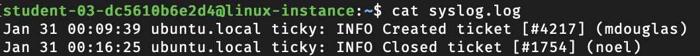
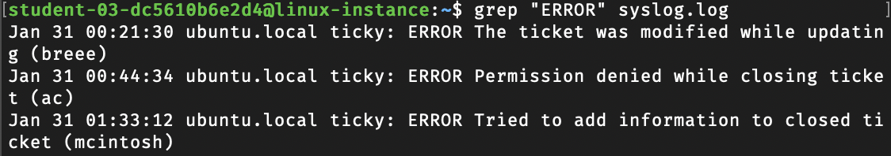
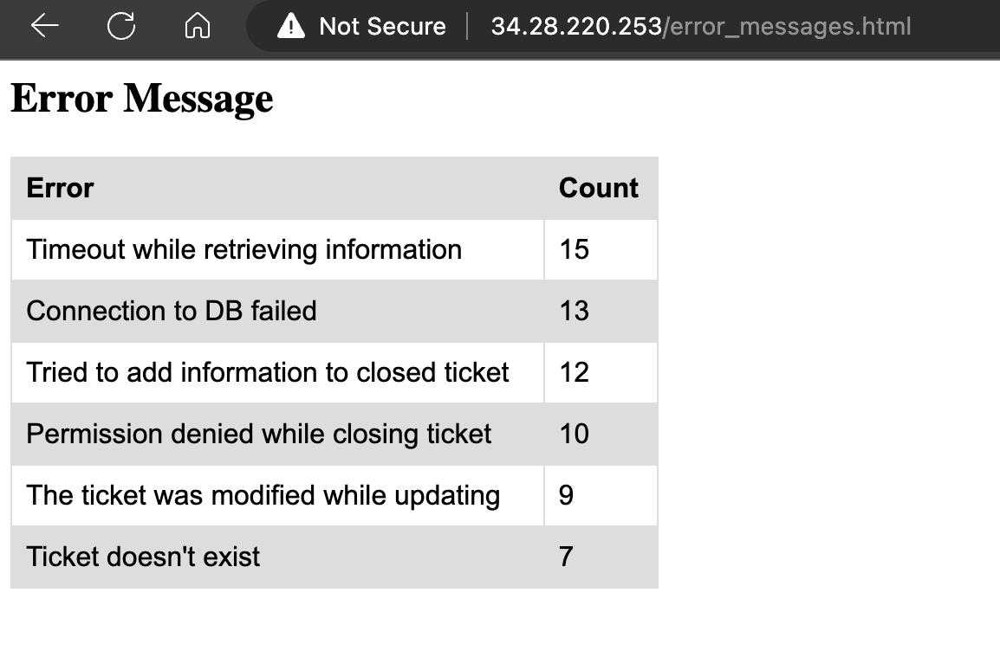
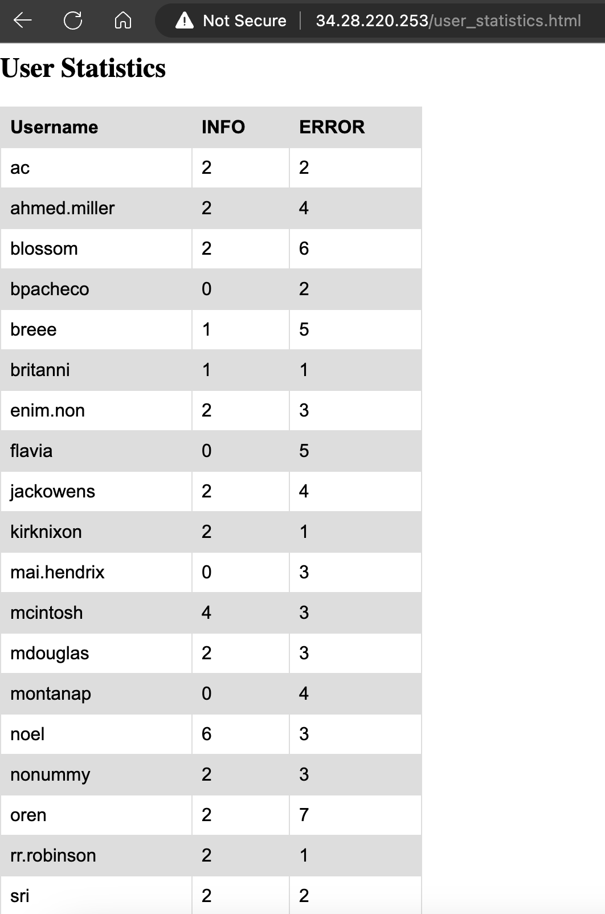
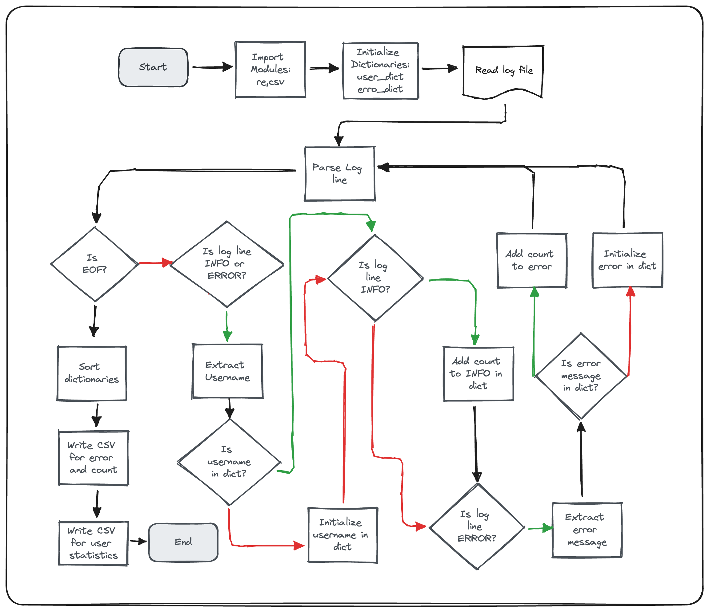

# Log Analysis Using Regular Expresissions

## Exercise - 1

```bash
cat syslog.log
```




```bash
grep "ERROR" syslog.log
```



```python
import re

line = "May 27 11:45:40 ubuntu.local ticky: INFO: Created ticket [#1234] (username)"

re.search(r"ticky: INFO: ([\w ]*) ", line)
```

Output:

`<re.Match object; span=(29, 57), match='ticky: INFO: Created ticket '>`

```python
line = "May 27 11:45:40 ubuntu.local ticky: ERROR: Error creating ticket [#1234] (username)"

re.search(r"ticky: ERROR: ([\w ]*) ", line)
```

Output:

`<re.Match object; span=(29, 65), match='ticky: ERROR: Error creating ticket '>`


```python
fruit = {"oranges": 3, "apples": 5, "bananas": 7, "pears": 2}
sorted(fruit.items())
# output
#[('apples', 5), ('bananas', 7), ('oranges', 3), ('pears', 2)]
```

```python
import operator
sorted(fruit.items(), key=operator.itemgetter(0))
#[('apples', 5), ('bananas', 7), ('oranges', 3), ('pears', 2)]
sorted(fruit.items(), key=operator.itemgetter(1))
#[('pears', 2), ('oranges', 3), ('apples', 5), ('bananas', 7)]
sorted(fruit.items(), key = operator.itemgetter(1), reverse=True)
#[('bananas', 7), ('apples', 5), ('oranges', 3), ('pears', 2)]
```

## Execise - 3

```python
#CSV TO HTML

#!/usr/bin/env python3
import sys
import csv
import os

def process_csv(csv_file):
    """Turn the contents of the CSV file into a list of lists"""
    print("Processing {}".format(csv_file))
    with open(csv_file,"r") as datafile:
        data = list(csv.reader(datafile))
    return data
    
def data_to_html(title, data):
    """Turns a list of lists into an HTML table"""

    # HTML Headers
    html_content = """
<html>
<head>
<style>
table {
  width: 25%;
  font-family: arial, sans-serif;
  border-collapse: collapse;
}

tr:nth-child(odd) {
  background-color: #dddddd;
}

td, th {
  border: 1px solid #dddddd;
  text-align: left;
  padding: 8px;
}
</style>
</head>
<body>
"""


    # Add the header part with the given title
    html_content += "<h2>{}</h2><table>".format(title)

    # Add each row in data as a row in the table
    # The first line is special and gets treated separately
    for i, row in enumerate(data):
        html_content += "<tr>"
        for column in row:
            if i == 0:
                html_content += "<th>{}</th>".format(column)
            else:
                html_content += "<td>{}</td>".format(column)
        html_content += "</tr>"

    html_content += """</tr></table></body></html>"""
    return html_content


def write_html_file(html_string, html_file):

    # Making a note of whether the html file we're writing exists or not
    if os.path.exists(html_file):
        print("{} already exists. Overwriting...".format(html_file))

    with open(html_file,'w') as htmlfile:
        htmlfile.write(html_string)
    print("Table succesfully written to {}".format(html_file))

def main():
    """Verifies the arguments and then calls the processing function"""
    # Check that command-line arguments are included
    if len(sys.argv) < 3:
        print("ERROR: Missing command-line argument!")
        print("Exiting program...")
        sys.exit(1)
    
    # Open the files
    csv_file = sys.argv[1]
    html_file = sys.argv[2]
    
    # Check that file extensions are included
    if ".csv" not in csv_file:
        print('Missing ".csv" file extension from first command-line argument!')
        print("Exiting program...")
        sys.exit(1)
    
    if ".html" not in html_file:
        print('Missing ".html" file extension from second command-line argument!')
        print("Exiting program...")
        sys.exit(1)
    
    # Check that the csv file exists
    if not os.path.exists(csv_file):
        print("{} does not exist".format(csv_file))
        print("Exiting program...")
        sys.exit(1)

    # Process the data and turn it into an HTML
    data = process_csv(csv_file)
    title = os.path.splitext(os.path.basename(csv_file))[0].replace("_", " ").title()
    html_string = data_to_html(title, data)
    write_html_file(html_string, html_file)

if __name__ == "__main__":
    main()
```

```shell
sudo chmod +x csv_to_html.py

sudo chmod  o+w /var/www/html

./csv_to_html.py user_emails.csv /var/www/html/<html-filename>.html

ls /var/www/html
```


## Generate Reports

* Ranking of errors generated by the system.
* User usage statistics for the service.





