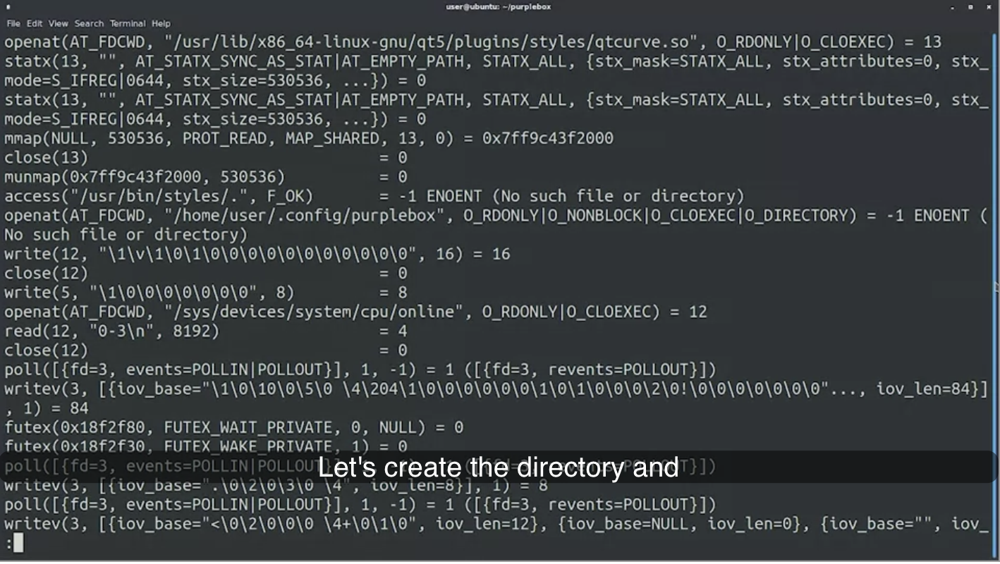
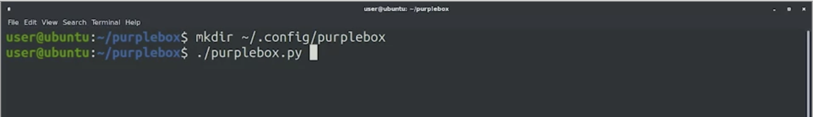
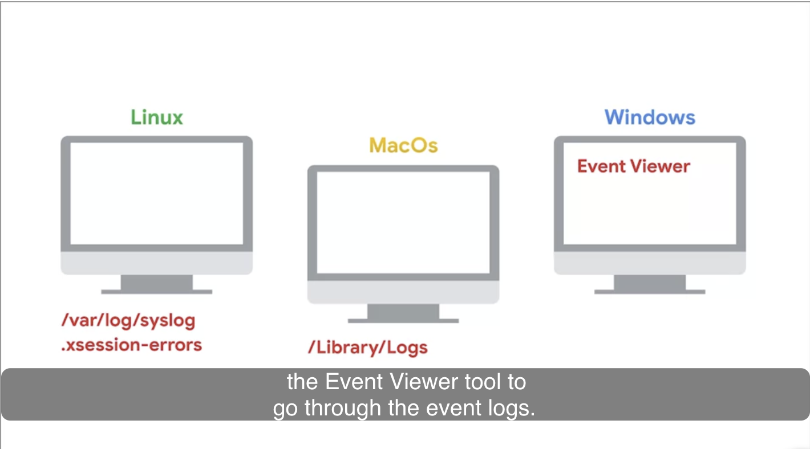
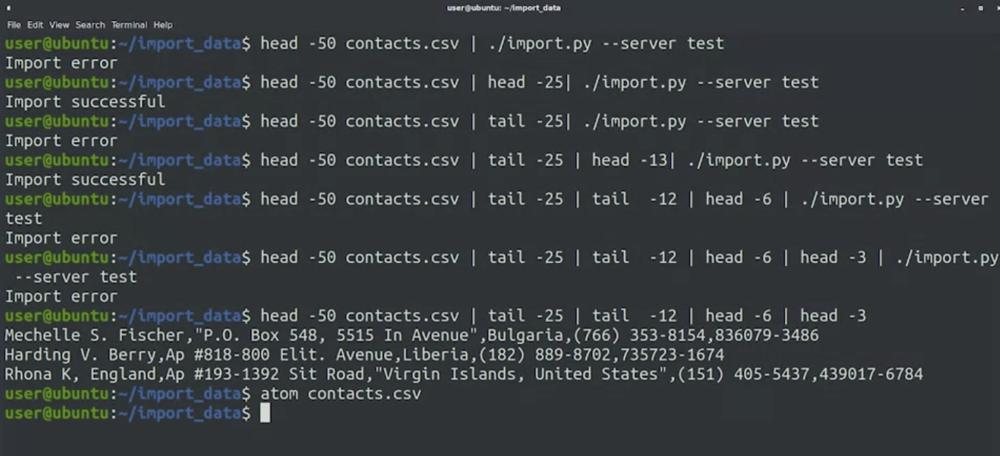

# Week 1
## Introduction to Debugging

**Troubleshooting**
Process of identifying, analyzing, and solving problems.

**Debugging**
Process of identifying, analyzing, and removing bugs in a system.

**Debuggers**
Allows for following code line by line, inspect changesi n variable assignments, interrupt the program when a specific condition is met, and more.

### Problem Solving Steps

1. Getting information
   Current state of things, what the issue is, when it happens, and what the consequences are.
   Can use existing documentation, manual pages, or questions on the internet.

   **Reporduction case** : Clear description of how and when the problem appears.

2. Find the root cause of the problem
   What triggered the problem and how it can be changed.

3. Perform necessary remediation
   Immediate remediation and then plan for long term remediation.

   What can be done to prevent the issue from happening again.

4. Document what was done.

### Siletly Crashing Application

`strace` shows all system calls a program makes.

**System calls** are actions that programs make to kernel.

`strace -o` outputs results into file.

Recreate the problem. In this case, the program fails when there is no `.config` directory.

Next is to create a temporary solution by informing users of how to solve and then inform developers so they can include fix in next version.

## Understanding the Problme

### "It Doesn't Work"

1. What were they trying to do?
2. What steps did they follow? 
3. What was the expected result?
4. What did they get instead?
   
1. Try to reproduce the error
2. Check each system component one after the other.

### Creating a Reproduction Case

**Reproduction case** is a way to verify if the problem is present or not.

Read logs available.
- Which logs depend on the OS and type of application trying to debug

Try to isolate the problem.
- Do other users experience the same
- Will the same user experience the same in a different computer.

Replicate user problem on own machine.
- Does problem go away if using a different app version
- Difference in strace and ltrace?
  
### Finding the Root Cause

It might seem that once you have the reproduction case, you already know the root cause of the problem.

Understanding the root cause is important for long term remediation.

Whenever possible, debug using test environment.

`iotop`
`ionice`
`rsync`
`iftop`
`nice`

### Dealing with Intermittent Issues

- Intermittent bugs are hard to reproduce and debug because they don't always happen.
- To debug them, first try to get more information by:
- Enabling more logging/debug mode in the software if possible.
- Monitoring the environment (cpu, memory, network, etc) when the issue occurs.
- May require multiple iterations to get enough data.
- Some bugs disappear when debugging - called "Heisenbugs". Caused by bad resource management.
- Bugs fixed by restarting point to improper resource handling.
- Schedule restarts if unable to find root cause.
- Key terms:
- Intermittent bug - Issue that only happens sometimes, not consistently.
- Heisenbug - Bug that goes away when trying to observe or debug it.
- Logging - Recording debug information about program execution.
- Resource management - Properly handling allocation/deallocation of limited resources like memory, files, network connections.

## Binary Searching a Problem

**What is binary search?**

- Linear search involves checking each list element sequentially until a match is found.
- Linear search's efficiency decreases with longer lists, taking time proportional to list length.
- Binary search is an alternative algorithm for sorted lists.
- Binary search leverages sorted order, comparing the target with the middle element to narrow down the search range.
- Binary search eliminates half the list with each comparison, resulting in fewer comparisons.
- Linear search may require many comparisons, especially for longer lists.
- Binary search's worst-case scenario involves significantly fewer comparisons, logarithmic to the list's length.
- Binary search requires a sorted list, and sorting takes time.
- Binary search is ideal for multiple searches on a sorted list.
- If only one search is needed, linear search might be simpler and faster

### Applying Binary Search in Troubleshooting

1. **Binary Search Concept:**
    - efficient algorithm for finding elements in a sorted list.
    - involves dividing the problem into halves with each step to quickly narrow down the solution.
2. **Applying Binary Search in Troubleshooting:**
    - can help find the root cause by systematically reducing possibilities.
    - By bisecting the list of hypotheses, number of tests needed are cut
3. **Practical Example:**
    - A failing program with many potential causes can be diagnosed using binary search.
    - Example: Identifying a faulty configuration file from a list of files causing a crash.
4. **Applicability to Various Problems:**
    - Binary search can be applied to issues like finding faulty browser extensions, plug-ins causing memory issues, or problematic code changes.
    - Git's "bisect" command assists in finding code changes causing failures, aiding in reporting bugs.
5. **Efficiency with Larger Lists:**
    - benefits are more prominent with larger lists, as it significantly reduces the number of attempts.
    - small options can be checked one by one, binary search shines with extensive lists.

### Finding Invalid Data

