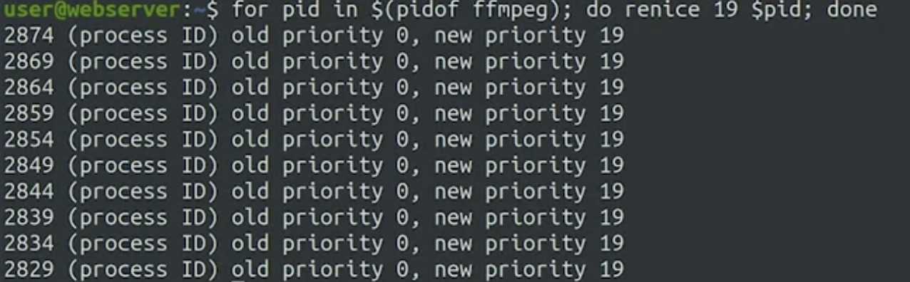
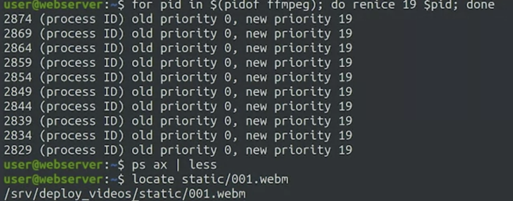
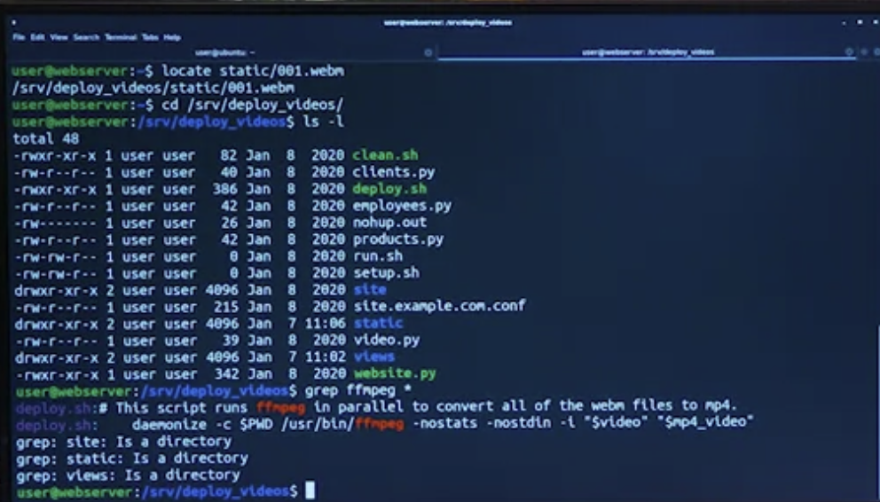
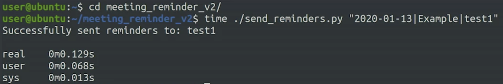
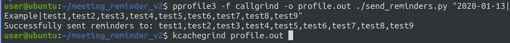
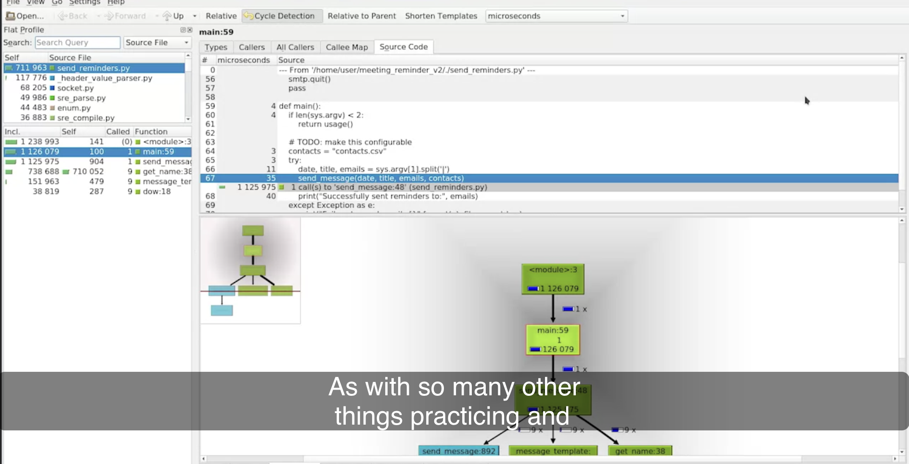

# Slowness

## Understanding Slowness

```bash
for pid in $(pidof ffmpeg); do renice 19 $pid; done

ps ax | less

locate static/001.webm
```







1. **Using Apache Benchmark (ab) Tool:**
    - Run Apache Benchmark tool to test website speed:

        ```bash
        ab -n 500 site.example.com
        
        ```

    - This runs 500 requests to measure average response time.
2. **Investigating CPU Overload:**
    - Check server load using **`top`** command:

        ```css
        top
        
        ```

3. **Changing Process Priorities:**
    - Use **`renice`** to change priorities of ffmpeg processes:

        ```bash
        for pid in $(pidof ffmpeg); do renice 19 $pid; done
        
        ```

4. **Checking Processes:**
    - Use **`ps ax`** to view running processes:

        ```bash
        ps ax | less
        
        ```

5. **Finding ffmpeg Processes:**
    - Search for ffmpeg processes using **`/`** in **`less`**:

        ```bash
        /ffmpeg
        
        ```

6. **Finding Process-Related Files:**
    - Use **`locate`** to find files containing "static/001.webm":

        ```arduino
        locate static/001.webm
        
        ```

7. **Editing Files with Vim:**
    - Edit a file using Vim:

        ```
        vim file_name
        
        ```

8. **Stopping and Controlling Processes:**
    - Stop ffmpeg processes using **`killall`**:

        ```vbnet
        killall -STOP ffmpeg
        
        ```

    - Resume ffmpeg processes:

        ```
        killall -CONT ffmpeg
        
        ```

9. **Automating Process Control:**
    - Automate controlling processes using a loop and **`kill -CONT`**:

        ```bash
        for pid in $(pidof ffmpeg); do kill -CONT $pid && while kill -0 $pid 2>/dev/null; do sleep 1; done; done
        
        ```

10. **Re-running Benchmark:**
    - Run Apache Benchmark again after changes:

        ```
        ab -n 500 site.example.com
        ```

# Monitoring Tools

Check out the following links for more information:

- <https://docs.microsoft.com/en-us/sysinternals/downloads/procmon>
- <http://www.brendangregg.com/linuxperf.html>
- <http://brendangregg.com/usemethod.html>
- [Activity Monitor in Mac](https://support.apple.com/en-us/HT201464):
- [Performance Monitor on Windows](https://www.windowscentral.com/how-use-performance-monitor-windows-10)
- <https://www.digitalcitizen.life/how-use-resource-monitor-windows-7>
- <https://docs.microsoft.com/en-us/sysinternals/downloads/process-explorer>
- [https://en.wikipedia.org/wiki/Cache_(computing)](https://en.wikipedia.org/wiki/Cache_(computing))
- <https://www.reddit.com/r/linux/comments/d7hx2c/why_nice_levels_are_a_placebo_and_have_been_for_a/>

---

## Slow Code

### Writing Efficient Code

Always start by wiring clear code that does what it should and only try to make it faster if we realize it's not fast enough.

Readable, easy to maintain, easy to understand.

`Profiler`: a tool that measure resources that code is using, giving a better understanding of what's going on.

`gprof`: analyze C code.

### Using the Right Data Structures


### Slow Script with Expensive Loop



`real`: actual time to execute command / `wall clock time`
`user`: time spent for operations in user space
`sys`: time spent for system level operations

`pprofile3`: profiler


`kcachegrind`: gui for looking at files




## When Slowness Gets Complex

### Parallelizing Operations

`Concurrency`

`Threads`: Parallel tasks inside a process.

`threading` `asyncio` modules in Py.

- Parallel operations can make scripts more efficient by allowing other work to continue while waiting for slow I/O.
- Concurrency is a field in computer science focused on parallel operations.
- The operating system (OS) manages processes, distributing them across CPU cores.
- Running operations in parallel can be achieved by dividing tasks among different processes.
- Balancing different workloads on a computer can enable parallel execution.
- Threads allow parallel tasks within a single process, sharing some memory.
- Threading implementations vary by programming language.
- Python offers Threading and AsyncIO modules for threading and asynchronous events.
- Depending on whether a script is I/O bound or CPU bound, parallel execution strategies vary.
- Too many parallel processes can slow down systems due to resource contention.
- Balancing simultaneous actions is essential for optimal parallel execution.
- Applying concurrency can significantly improve script performance.
- Practical example: Migrating data using threads and distributed processing reduced migration time.
- Complex concepts are normal; learning at your own pace is important.

### Slowly Growing in Complexity

- Solutions that work well for one problem might not be suitable for different problems.
- As systems become more complex and usage grows, solutions that were previously effective may no longer be suitable.
- Example of progression: Starting with a CSV file for secret Santa, moving to SQLite, transitioning to a database server, and adding a caching service for performance.
- Similar progression can occur on the user-facing side, transitioning from local web server to adding caching services and load balancers as the service grows.
- Importance of finding the right solution for each problem and adapting based on the growth and requirements of the service.

### Dealing with Complex Slow Systems

- Complex systems involve multiple computers interacting through networks, performing various tasks.
- Identifying performance bottlenecks is crucial; monitoring infrastructure helps pinpoint where time is spent.
- Examples of potential issues include slow web pages due to network calls and database server with heavy disk I/O.
- Strategies for addressing issues include optimizing database indexes, caching queries, or distributing data across servers.
- If CPU saturation occurs, optimize code, consider adding caching, and distribute load across multiple computers.
- Reevaluate if certain layers or components are necessary; projects can accumulate unnecessary complexity.
- Seeking help from colleagues is an effective way to navigate challenges in dealing with complex systems.

### Using Threads to Make Things Go Faster

- Issue: E-commerce site needs to replace product images due to rebranding.
- Problem: Current script for creating thumbnails is slow.
- Initial test: Current script takes 2 seconds for 1,000 images.
- Solution: Implement parallel processing using ThreadPoolExecutor or ProcessPoolExecutor from the futures module.
  - Submit tasks to the executor for parallel execution.
  - Threads: Faster user time, utilizes available processors.
  - Processes: Faster overall time, even higher user time due to CPU usage.
- Result: ProcessPoolExecutor reduces time to less than 1 second.
- Further improvements suggested: Checking for existing and up-to-date thumbnails, adding progress indicators.

### More About Complex Slow Systems

We only touched briefly on the ways we can use concurrency to improve our programs. If you're interested in learning more, [this article](https://realpython.com/python-concurrency/) from Real Python has a lot of details on the different ways to use concurrency in Python.

Check out the following links for more information:

<https://realpython.com/python-concurrency/>

<https://hackernoon.com/threaded-asynchronous-magic-and-how-to-wield-it-bba9ed602c32>
