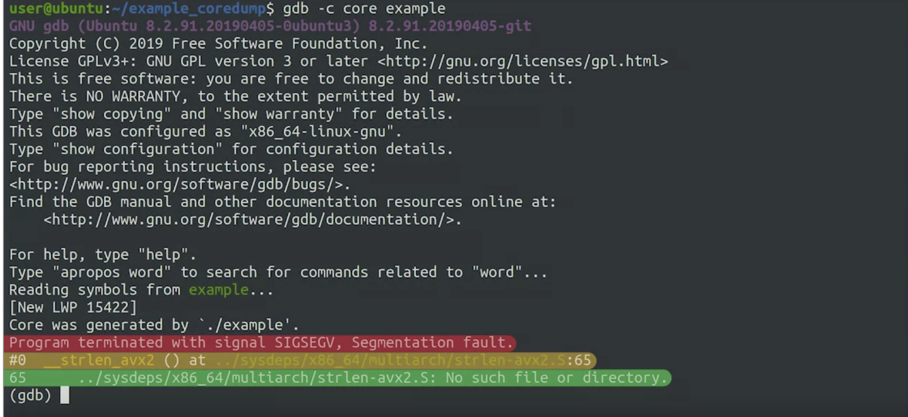

# Crashing Programs

- [Crashing Programs](#crashing-programs)
  - [Why Programs Crash](#why-programs-crash)
    - [Systems That Crash$$](#systems-that-crash)
    - [Understanding Crashing Applications](#understanding-crashing-applications)
    - [What to do](#what-to-do)
    - [Internal Server Error](#internal-server-error)
  - [Steps to Diagnose](#steps-to-diagnose)
    - [Resources for Understanding Crashes](#resources-for-understanding-crashes)
    - [Resources for Understanding Crashes](#resources-for-understanding-crashes-1)
  - [Code that Crashes](#code-that-crashes)
    - [Accessing Invalid Memory](#accessing-invalid-memory)
    - [Unhandled Errors and Exceptions](#unhandled-errors-and-exceptions)
    - [Fixing Someone Else's Code](#fixing-someone-elses-code)
    - [Debugging a Segmentation Fault](#debugging-a-segmentation-fault)
    - [Debugging a Python Crash](#debugging-a-python-crash)
    - [Resources for Debugging Crashes](#resources-for-debugging-crashes)
  - [Handling Bigger Incidents](#handling-bigger-incidents)
    - [Crashes in Complex Systems](#crashes-in-complex-systems)
    - [Communication and Documentation During Incidents](#communication-and-documentation-during-incidents)
    - [Writing Effective Postmortems](#writing-effective-postmortems)

## Why Programs Crash

### Systems That Crash$$

**Diagnosing Application Crashes**

- Applications can crash due to various reasons.
- Diagnosis process involves:
    1. Gathering information about the crash.
    2. Identifying the root cause.
    3. Applying the appropriate solution.

**Steps in Diagnosing Application Crashes**

- **Scope Reduction:**
  - Gather details about the crash scenario.
  - Start with easier and faster checks.
  - Determine if issue is specific to the machine.
- **Issue Reproduction:**
  - Verify if the problem can be consistently replicated.
  - Check if specific actions or scenarios trigger the crash.
- **Machine-Specific Scope:**
  - Confirm problem is isolated to one machine.
  - Investigate installation and configuration issues.
- **Random Crashes:**
  - Analyze if crashes occur randomly.
  - Determine if issue affects entire system or just the application.
- **System-Wide Investigation:**
  - Move to default application configuration or reinstall.
  - Inquire about crashes in other applications.
- **Hardware Consideration:**
  - If problem persists, hardware might be at fault.
  - Test by placing the hard drive in a different computer.
- **RAM Examination:**
  - Check RAM health using memtest86 tool.
  - Deteriorating memory can cause data inconsistency.
- **Overheating and External Devices:**
  - Monitor temperature data for overheating issues.
  - Disconnect/replacement of external devices (graphics card, etc.).
- **Hard Drive Inspection:**
  - Aging hard drives can cause data mismatches.
  - Use OS-specific tools to check for bad sectors.
  - Utilize SMART tools for error detection and prevention.
- **Possible OS Issues:**
  - If hard drive is fine, investigate OS problems.
  - Decide between extensive troubleshooting or OS reinstallation.

**Application-Specific Crashes**

- Applications can misbehave due to coding issues.
- Code might not handle unexpected scenarios.
- Need to analyze application's code for such situations.

### Understanding Crashing Applications

1. Look at log files
   - Linux V
     - System log files at VAR Log
     - User log files at .xsession files
   - Mac OS
     - Console app for logs
   - Windos
     - EventViewer
  
2. Tools to check program function
   - Linux
     - Strace
   - MacOS
     - dtruss
   - Windows
     - Process monitor

To find root cause of crashing application: Look at all available logs, figure out what changed, trace system or library calls the program makes, create smallest possible reproduction case.

### What to do

**Wrapper** a function or program that provides compatibility layer between two functions or programs so they can work well together.

**Working Around Application Crashes**

- **Challenges in Fixing Others' Code:**
  - Can't always change or understand the code.
  - Proprietary software or unfamiliar languages may hinder modifications.

**Strategies for Working Around Crashes**

- **Data Input Compatibility:**
  - Identify crashes due to incorrect input format.
  - Write a script to preprocess data into expected format.
- **External Service Compatibility:**
  - If application relies on incompatible external service, create a compatibility layer (Wrapper) to mediate requests and responses.
- **System Environment Matching:**
  - Ensure application environment matches developers' recommendations.
  - Align operating system, dynamic libraries, and backend services.
- **Virtualization and Containers:**
  - Run application in isolated environment via virtual machine or container.
  - Isolation prevents interference with other applications.
- **Implementing a Watchdog:**
  - Deploy a watchdog process to monitor and restart crashed program.
  - Ensures service availability even if crashes occur.
- **Bug Reporting:**
  - Always report crashes to application developers.
  - Provide comprehensive information, including reproduction case and detailed steps.

**Bug Reporting Information**

- **Details to Include:**
  - Describe attempted action and steps.
  - Specify expected outcome and actual result.
  - Share a good reproduction case if possible.

### Internal Server Error

## Steps to Diagnose

1. **Initial Alert:**
    - Colleague reports webpage issue at **`site.example.com/blogs`**.
2. **Error Confirmation:**
    - Checked the webpage, encountered a 500 error.
3. **Log Examination:**
    - Explored logs in **`/var/log`**.
    - Used **`date`** command for current date.
    - Checked for recent error logs with **`ls -lt | head`**.
4. **No Recent Logs:**
    - No relevant entries found.
    - Reviewed last lines in syslog using **`tail`**.
5. **Network Check:**
    - Determined web server runs on port 80.
    - Used **`netstat`** with **`sudo`** to show listening sockets.
    - Used flags **`n -l -P`** with **`grep`** for port 80.
6. **Identifying Web Server:**
    - Discovered process named "nginx" on port 80.
    - Nginx is the web server software in use.
7. **Nginx Configuration:**
    - Explored **`/etc/nginx`** for config files.
    - Checked sites-enabled directory: **`/etc/nginx/sites-enabled`**.
    - Opened specific site config using **`vi`**.
8. **uWSGI Configuration:**
    - Config points to uWSGI server.
    - Explored **`/etc/uwsgi`** directory.
    - Checked **`apps-enabled`** subdirectory.
    - Examined uWSGI configuration file.
9. **Python Script Analysis:**
    - Opened Python script (**`prod.py`**) mentioned in uWSGI config.
    - Script uses bottle for dynamic web pages.
    - Uncovered debugging instruction in script.
10. **Modifying Script:**
    - Attempted to uncomment debugging line.
    - Needed write access; reopened **`vi`** with **`sudo`**.
11. **Applying Changes:**
    - Saved the modified script.
    - Reloaded uWSGI with **`sudo service uwsgi reload`**.
12. **Debugging Output:**
    - Accessed the webpage again.
    - Debugging output revealed permission denied error.
    - Identified issue with **`var/log/site.log`**.
13. **Log Examination:**
    - Checked **`site.log`** and **`site.log.1`** files.
    - Noticed file ownership discrepancies.
    - File permissions restricted other users' access.
    - Incompatible owner for app's user.
14. **Ownership Correction:**
    - Changed ownership of **`site.log`** to **`www-data`**.
    - Reloaded the webpage.
15. **Success:**
    - Webpage loaded successfully.
    - Empty log file indicated write access issue.
    - Logs populated upon reloading.
16. **Long-Term Action:**
    - Immediate issue resolved, but root cause not addressed.
    - Suspected issue with log rotation configuration.
    - Need further investigation for full remediation.

**Conclusion:**

- Utilized various tools and methods to diagnose webpage error.
- Investigated logs, network connections, server software, and configurations.
- Modified Python script and corrected file ownership for temporary fix.
- Long-term solution requires investigating log rotation configuration.

### Resources for Understanding Crashes

There's a ton of different reasons why a computer might crash. This [Scientific American article](https://www.scientificamerican.com/article/why-do-computers-crash/) discusses many of the possible reasons, including hardware problems and issues with the overall operating system or the applications on top.

On Linux or MacOS, the worst kind of crash is called a Kernel Panic. On Windows, it's known as the [Blue Screen of Death](https://en.wikipedia.org/wiki/Blue_Screen_of_Death). These are situations where the computer completely stops responding and only a reboot can make it work again. They don't happen often, but it's good to understand what they mean: the whole OS encountered an error and it can't recover.

We called out that reading logs is super important. You should know how to read logs on the operating system that you're using. Here are some resources for this:

- [How to find logs on Windows 10](https://www.digitalmastersmag.com/magazine/tip-of-the-day-how-to-find-crash-logs-on-windows-10/) (Digital Masters Magazine)
- [How to view the System Log on a Mac](https://www.howtogeek.com/356942/how-to-view-the-system-log-on-a-mac/) (How-to Geek)
- [How to check system logs on Linux](https://www.fosslinux.com/8984/how-to-check-system-logs-on-linux-complete-usage-guide.htm) (FOSS Linux)

You also need to be familiar with the tools available in your OS to diagnose problems. These are the tools we called out, but you don't need to limit yourself to them:

- [Process Monitor](https://docs.microsoft.com/en-us/sysinternals/downloads/procmon) for Windows (Microsoft)
- [Linux strace command tutorial for beginners](https://www.howtoforge.com/linux-strace-command/) (HowtoForge)
- [How to trace your system calls on Mac OS (/etc/notes)](http://neurocline.github.io/dev/2015/05/24/Tracing-System-Calls.html)

---

### Resources for Understanding Crashes

There's a ton of different reasons why a computer might crash. This [Scientific American article](https://www.scientificamerican.com/article/why-do-computers-crash/) discusses many of the possible reasons, including hardware problems and issues with the overall operating system or the applications on top.

On Linux or MacOS, the worst kind of crash is called a Kernel Panic. On Windows, it's known as the [Blue Screen of Death](https://en.wikipedia.org/wiki/Blue_Screen_of_Death). These are situations where the computer completely stops responding and only a reboot can make it work again. They don't happen often, but it's good to understand what they mean: the whole OS encountered an error and it can't recover.

We called out that reading logs is super important. You should know how to read logs on the operating system that you're using. Here are some resources for this:

- [How to find logs on Windows 10](https://www.digitalmastersmag.com/magazine/tip-of-the-day-how-to-find-crash-logs-on-windows-10/) (Digital Masters Magazine)
- [How to view the System Log on a Mac](https://www.howtogeek.com/356942/how-to-view-the-system-log-on-a-mac/) (How-to Geek)
- [How to check system logs on Linux](https://www.fosslinux.com/8984/how-to-check-system-logs-on-linux-complete-usage-guide.htm) (FOSS Linux)

You also need to be familiar with the tools available in your OS to diagnose problems. These are the tools we called out, but you don't need to limit yourself to them:

- [Process Monitor](https://docs.microsoft.com/en-us/sysinternals/downloads/procmon) for Windows (Microsoft)
- [Linux strace command tutorial for beginners](https://www.howtoforge.com/linux-strace-command/) (HowtoForge)
- [How to trace your system calls on Mac OS (/etc/notes)](http://neurocline.github.io/dev/2015/05/24/Tracing-System-Calls.html)

---

## Code that Crashes

### Accessing Invalid Memory

**Common Cause: Invalid Memory Access:**

- Crashes occur due to attempts to access unallocated memory.
- Modern OS memory organization: processes, memory chunks, mapping table.
- Invalid memory access: accessing unassigned memory regions.
- Rooted in programming errors, especially common in low-level languages like C/C++.
- Memory address-holding variables known as pointers can lead to invalid memory access.

**Programming Errors Leading to Invalid Memory Access:**

- Forgetting to initialize variables.
- Accessing list elements beyond valid range.
- Using memory after it's been returned.
- Writing excessive data beyond memory capacity.

**Debugging Invalid Memory Access:**

- Attaching debugger to analyze crashing program behavior.
- Debugger provides function specifics, parameter values, and invalid addresses.
- Debugger uncovers issues like late initialization, list overflows, etc.
- Compiling with debugging symbols for detailed debugging data.

**Debugging Tools:**

- Linux distributions offer separate debugging symbol packages.
- **Valgrind (Linux, Mac OS)** and **Dr. Memory (Windows, Linux)** detect invalid operations.
- Valgrind identifies uninitialized variables, memory leaks, pointer problems, etc.

**Undefined Behavior and Platform Variance:**

- Invalid memory actions result in undefined outcomes.
- Consequences vary based on compiler, OS, and library versions.
- Code functioning on one platform might fail on another.

**Fixing Invalid Memory Issues:**

- Identify root causes through debugging sessions.
- Modify code or collaborate with developers for remedies.
- Solutions might entail relocating initializations, adjusting loops, etc.

**Applying Concepts Across Languages:**

- Concepts universally applicable to any programming language.
- Encouragement to confidently apply these skills.

**Collaborative Solutions:**

- Open-source projects may offer existing solutions.
- Apply available patches or collaborate with developers.
- Seek guidance to address issues and craft patches if needed.

**High-Level Languages and Exception Handling:**

- High-level languages like Python manage errors using exceptions.
- Exceptions prevent invalid memory access from reaching the OS.

### Unhandled Errors and Exceptions

**Understanding and Handling Invalid Memory Access:**

- Discussed consequences of attempting to access invalid memory.
- Different programming languages like Python, Java, and Ruby manage memory handling.
- Programs written in high-level languages can still encounter issues causing errors or exceptions.
- Unexpected conditions trigger errors that interrupt program execution.

**Handling Errors and Exceptions in High-Level Languages:**

- Unhandled errors in high-level languages lead to program termination.
- Examples in Python: index error, type error, attribute error, division by zero error.
- Errors arise due to incorrect assumptions, resource absence, or user input mismatches.
- Interpreters print error type, line of failure, and traceback details.

**Debugging Unhandled Errors:**

- Interpreter provides error message and traceback, aiding in problem identification.
- Issues might not be localized to the failing function.
- Debugging tools specific to language used are valuable for pinpointing errors.
- **PDB interactive debugger** useful for Python debugging, enabling step-by-step execution and variable tracking.

**Print Debugging and Adding Messages:**

- **Printf debugging** technique involves inserting print statements for debugging.
- Display variable contents, function return values, list lengths, etc.
- Common practice across languages, using functions like print, puts, or echo.
- Messages should be added with consideration for enabling/disabling them.

**Structured Debugging with Logging:**

- **Logging module** in Python for structured debugging messages.
- Allows setting message comprehensiveness based on debug levels.
- Differentiates between info, warning, error messages.
- Debug level can be adjusted using flags or configurations.

**Resilient Code and Handling Failures:**

- Solutions after identifying issues involve fixing programming errors.
- Enhancing code for unconsidered use cases may be necessary.
- Aim to make code resilient to failures, informing users of issues instead of crashing.

**Examples of Handling Errors:**

- Example: Permission denied error - code should catch and inform users of the issue.
- Critical conditions might warrant program termination but with informative error messages.

### Fixing Someone Else's Code

**Fixing Others' Code in IT Jobs:**

- Common to address issues and modify code not written by oneself.
- Open-source programs or code within the company often require attention.
- Acquainting oneself with the code is essential for understanding and fixing issues.

**Approaches to Understand Someone Else's Code:**

- Code comments and documentation provide initial insights.
- Well-commented functions and documentation aid in comprehension.
- Adding comments while reading improves understanding and benefits others.
- Reading associated tests reveals expected function behaviors and unconsidered use cases.
- Writing additional tests helps clarify code's purpose and improve its quality.

**Reading Someone Else's Code:**

- Personal preference and project size dictate reading approach.
- For smaller projects, reading entire codebase is feasible.
- In larger projects, focus on functions or modules relevant to the problem.
- Trace through error-causing function, then its callers to grasp context.

**Understanding Code in Unfamiliar Languages:**

- Familiarity with programming language helps but isn't mandatory.
- Strong debugging skills can guide issue identification and resolution.
- Practice enhances ability to navigate and comprehend unfamiliar code.

**Practice Techniques for Reading Code:**

- Practice on programs you use and have access to their code.
- Understand specific actions in the code by tracing its execution.
- Study web server configuration parsing or module data processing.
- Engage with open-source projects, attempt fixing easy issues.
- Practice improves code comprehension, debugging speed, and project contribution.

**Enhancing Skills:**

- Improving ability to decipher code and implement fixes.
- Practice reading code in various contexts.
- Participate in open-source projects to gain hands-on experience.
- Develop skills to swiftly understand and modify code.

### Debugging a Segmentation Fault

**Understanding Segmentation Faults and Core Files:**

- Segmentation faults and their impact on program crashes.
- Core files store crash information for later debugging.
- Generating core files using the **`ulimit`** command:
  - **`ulimit -c unlimited`**: Configures the OS to generate core files of any size.

**Analyzing Core Files with GDB Debugger:**

- Using the GDB (GNU Debugger) to analyze crashes.
- Command to launch GDB and analyze a core file:
  - **`gdb -c core example`**: Initiates GDB with the specified core file and executable.

**Navigating the Backtrace and Code Context:**

- Examining backtraces to trace crash sequence.
- Using GDB commands to navigate the backtrace:
  - **`backtrace`** or **`bt`**: Displays a list of function calls leading to the crash.
  - **`up`**: Moves up the backtrace to inspect calling functions.
  - **`list`** followed by line number: Shows code context around a specific line.

**Identifying the Bug: Off-by-One Error:**

- Understanding off-by-one errors and their common occurrence.
- Inspecting variables and memory addresses using GDB:
  - **`print`** or **`p`** followed by variable: Displays the value of a variable.
  - **`print argv[0]`** and **`print argv[1]`**: Prints values of elements in the **`argv`** array.
- Hexadecimal addresses indicating memory locations.
- Null pointer indicating the end of data structures.
- Fixing the bug by modifying loop condition:
  - Changing **`<=`** to **`<`** in a loop to avoid overiteration.

### Debugging a Python Crash

**Dealing with Python Exceptions:**

- Overview of handling unexpected exceptions in Python.
- Introduction to a script that updates product descriptions in a company's database.
- Mention of an issue where the script fails with an exception.

**Analyzing Exception Traceback:**

- Examining the traceback of the exception:
  - Understanding the type of exception (KeyError).
  - Identifying the failing key ("product code").
- Reversed order of function calls in the traceback.
- Exploring the hierarchy of functions: **`update_data`**, **`main`**, and module level.

**Using Python Debugger (pdb3):**

- Introducing the Python debugger **`pdb3`** for debugging.
- Running the debugger on the script with its parameters: **`pdb3 update_products.py new_products.csv`**.
- Positioning at the start of the script and awaiting debugger commands.

**Continuing Execution and Debugging:**

- Commanding the debugger to continue execution: **`c`** or **`continue`**.
- Observing the program failure under debugger control.
- Using debugger to print variable content: **`p`** or **`print`** followed by variable name.

**Fixing the Issue and Conclusion:**

- Identifying unexpected characters before "product code" in the printed variable.
- Explanation of the Byte Order Mark (BOM) and its relevance.
- Introducing **`UTF-8-sig`** encoding as a solution to handle BOM.
- Modifying the code to use the new encoding parameter.
- Successful execution of the script after the modification.

**Advanced Debugging Techniques:**

- Mention of advanced debugging features and tools like GDB and PDB.
- Highlighting advanced techniques such as breakpoints, watch points, and stepping through instructions.
- Acknowledgment that the video covered only basic debugging aspects, with more resources available for those seeking in-depth knowledge.$$

### Resources for Debugging Crashes

Check out the following links for more information:

- <https://realpython.com/python-concurrency/>
- <https://hackernoon.com/threaded-asynchronous-magic-and-how-to-wield-it-bba9ed602c32>
- <https://stackoverflow.com/questions/33047452/definitive-list-of-common-reasons-for-segmentation-faults>
- <https://sites.google.com/a/case.edu/hpcc/hpc-cluster/software/programming-computing-languages/cc/debugging-segmentation-faults>

Readable Python code on GitHub:

- <https://github.com/fogleman/Minecraft>
- <https://github.com/cherrypy/cherrypy>
- <https://github.com/pallets/flask>
- <https://github.com/tornadoweb/tornado>
- <https://github.com/gleitz/howdoi>
- <https://github.com/bottlepy/bottle/blob/master/bottle.py>
- <https://github.com/sqlalchemy/sqlalchemy>

---

## Handling Bigger Incidents

### Crashes in Complex Systems

**Troubleshooting Complex Systems:**

- Discussing the challenge of diagnosing errors in complex systems with multiple services.
- Example scenario: e-commerce site experiencing internal server errors.

**Using Logs to Identify Issues:**

- Emphasizing the importance of checking log messages in servers for additional information.
- Searching for service-specific logs and examining general system logs.
- Discovering log entries mentioning "invalid response from server."

**Identifying Recent Changes:**

- Highlighting the significance of changes made between when the system was working and when the issue arose.
- Investigating changes in system versions, deployments, and underlying services.

**Rolling Back Changes and Improving Error Messages:**

- Suggesting the strategy of rolling back suspected changes, even if not fully confirmed.
- Benefits of easy rollback in troubleshooting.
- Enhancing error messages to provide more context and details.

**Importance of Monitoring, Version Control, and Scalability:**

- Stressing the need for effective monitoring, version control, and rapid server deployment in complex systems.
- Mentioning automated deployment processes for cloud-based virtual machines.
- Cautioning about external limits and constraints on resources in cloud services.

**Additional Considerations for Resource Usage:**

- Noting potential limitations on resources like CPU time, RAM, network bandwidth, and external services in cloud environments.
- Addressing problems related to these constraints through resource optimization.

### Communication and Documentation During Incidents

**Importance of Communication and Documentation:**

- Emphasizing the need for clear communication during troubleshooting.
- Documenting actions and outcomes in a bug/ticket, document, text file, or Wiki.
- Benefits of documentation for tracking progress, sharing information, and avoiding redundant efforts.

**Communicating with Those Affected:**

- Communicating with users affected by the issue is crucial.
- Providing information about problem understanding, workarounds, and estimated resolution time.
- Regular updates for larger incidents; clear instructions for users to plan their actions.

**Task Distribution and Roles:**

- Involving a team in addressing larger incidents.
- Assigning roles to team members for efficient task distribution.
- Example roles: root cause analysis, solution finding, communication lead, incident commander/incident controller.
- Incident commander's role in resource allocation, preventing duplication of work, and overseeing production system changes.
- Adjusting roles based on incident size; simpler task distribution for smaller teams.

**Summarizing the Resolution:**

- Summarizing information once the issue is resolved.
- Key information: root cause, diagnosis process, solution details, preventive measures.
- Different formats: updating bug/ticket, or full postmortem.

### Writing Effective Postmortems

- **Importance of Communication and Documentation:**
  - Effective communication and documentation are crucial in troubleshooting to ensure proper coordination and learning from incidents.
  - Communication involves keeping users informed, providing regular updates, and managing expectations.
  - Documentation helps track steps taken, outcomes, and lessons learned.
  - Communication and documentation prevent misunderstandings, reduce frustration, and facilitate transparency.
- **Postmortems for Learning:**
  - **Postmortem:** A document detailing incident details, causes, impact, diagnosis, solutions, and preventive measures.
  - **Root Cause:** Fundamental reason behind an incident.
  - **Diagnosis:** Determining the cause and nature of an issue.
  - **Short-term Remediation:** Immediate actions to temporarily resolve an incident.
  - **Long-term Remediation:** Comprehensive solutions to prevent incident recurrence.
  - **Impact:** Consequences of an incident on systems, users, or services.
  - **Summary:** Concise overview of an incident, including cause, impact, and solutions.
  - **What Went Well:** Identifying positive aspects of incident response.
- **Benefits of Postmortems:**
  - **Learning:** Postmortems facilitate learning from mistakes to prevent recurrence.
  - **Prevention:** Identifying root causes helps implement preventive measures.
  - **Transparency:** Transparent documentation fosters trust and understanding.
  - **Accountability:** Postmortems encourage accountability for actions and decisions.
- **Practical Applications of Postmortems:**
  - Postmortems aren't limited to large incidents; they can be practiced for smaller scenarios.
  - Writing postmortems for personal experiences helps refine the process.
  - Principles of identifying causes, learning, and improving apply universally.
  - Practice summaries of key takeaways, focusing on lessons learned and preventive actions.
- **Tools and Technologies:**
  - **Communication Tools:** Used for regular updates to users and stakeholders.
  - **Documentation Tools:** Used for recording troubleshooting steps and outcomes.
  - **Version Control:** Helps track changes and enables easy rollbacks.
  - **Monitoring and Alerting:** Provides insights into system behavior and notifies of anomalies.
  - **Bug or Ticket System:** Used for tracking and updating incident progress.
  - **Wiki or Text Files:** Simple tools for recording documentation.
- **Best Practices:**
  - Implement regular communication with affected users.
  - Document troubleshooting steps and outcomes for future reference.
  - Encourage a culture of learning and improvement.
  - Practice writing postmortems for various scenarios.
  - Focus on the lessons learned and preventive actions.
