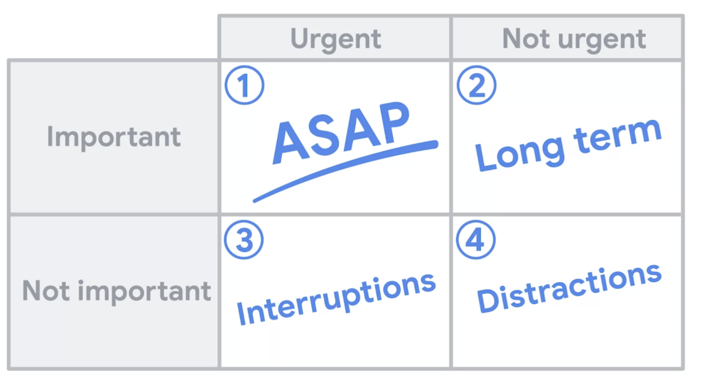

# Managing Resources

## Managing Computer Resources

### Memory Leaks and How to Prevent Them

- **Memory Management and Leaks**:
  - **Memory Management Process**:
    - How processes interact with the OS to request memory chunks.
    - Responsible for releasing memory when no longer needed.
  - **Memory Leak**:
    - When memory isn't released after use.
    - Can lead to system misbehavior as leaked memory accumulates.
  - **Effects of Memory Usage**:
    - Heavy RAM usage slows down other programs.
    - Exhausting available memory can cause system failures.
    - OS might terminate processes to free memory.
- **Languages and Memory Management**:
  - **C and C++**:
    - Programmers manually manage memory (allocation and deallocation).
    - Prone to memory leaks if deallocation is forgotten.
  - **Python, Java, Go**:
    - Use garbage collector to free unused memory.
    - Garbage collector identifies unreferenced memory for release.
- **Garbage Collection**:
  - **Mechanism**:
    - Identifies unused memory.
    - Frees memory for reuse.
  - **Example**:
    - Function returns, dictionary not referenced -> memory released.
    - Function returns dictionary -> memory retained.
- **Memory Profiling**:
  - **Purpose**:
    - Analyze memory usage in programs.
    - Identify unnecessary memory consumption.
  - **Tools**:
    - **Valgrind** for C/C++.
    - Various tools for Python.
  - **Features**:
    - Profiling memory usage at function level or overall.
    - Comparing memory snapshots.
- **Optimizing Memory Usage**:
  - **Goal**:
    - Keep only necessary data in memory.
    - Allow garbage collector to reclaim unused memory.
  - **Upgrading Hardware**:
    - Option if memory exhaustion persists.

### Managing Disk Space

- **Disk Usage and Issues**:
  - **Disk Space Utilization**:
    - Programs need disk space for various purposes.
    - Data storage, binaries, libraries, logs, temporary files, backups.
  - **Consequences of Low Disk Space**:
    - Performance decline due to fragmentation.
    - Programs crashing during write operations.
    - Data loss due to truncation.
- **Managing Disk Space**:
  - **User Machine**:
    - Uninstall unused applications.
    - Clean up old data.
  - **Server**:
    - Investigate closely, diagnose the issue.
    - Add extra drive if necessary.
- **Identifying Disk Space Issues**:
  - **Analyze Disk Usage**:
    - Examine space allocation across directories.
    - Differentiate valid data from unnecessary files.
  - **Misbehavior Patterns**:
    - Excessive logging of errors in system logs.
    - Creation of large temporary files without cleanup.
- **Deleted Files Taking Space**:
  - Temporary deleted files can accumulate.
  - Opened files read/write regardless of deletion status.
  - Large deleted files can consume all disk space.
- **Troubleshooting and Solutions**:
  - **Listing Opened Files**:
    - Identify large deleted files taking space.
    - Commands available for this purpose.
  - **Investigating Causes**:
    - Analyze what's using disk space.
    - Determine if it's expected behavior or an anomaly.
  - **Preventive Measures**:
    - Identify solutions and implement them.
    - Aim to prevent recurrence.

### Network Saturation

- **Network Connection Overview**:
  - Interaction with services across the Internet.
  - Latency and bandwidth key factors in network performance.
  - **Latency**:
    - Delay between sending and receiving data.
    - Affected by distance and intermediate devices.
  - **Bandwidth**:
    - Data capacity of the connection.
    - Usable bandwidth depends on endpoints and hops.
- **Latency and Bandwidth Interplay**:
  - Latency more noticeable for small data pieces.
  - Bandwidth crucial for large data chunks.
  - Latency's impact decreases with larger content.
- **Optimizing Network Connections**:
  - **Latency-Focused**:
    - For small data, prioritize low latency (<50-100 ms).
  - **Bandwidth-Focused**:
    - For large data, maximize available bandwidth.
- **Bandwidth Sharing and Traffic Shaping**:
  - Bandwidth shared among different connections.
  - Heavy usage impacts latency and overall speed.
  - **Traffic Shaping**:
    - Mark packets with different priorities.
    - Allows fair bandwidth distribution.
- **Network Connection Limits**:
  - Maximum connections per computer.
  - Bugs can lead to excessive or lingering connections.
  - Excessive connections on a server affect new user connections.

### Dealing with Memory Leaks

- **Memory Mismanagement and Profiling**:
  - Memory issues can arise from program behavior.
  - **Memory Leaks**:
    - Programs requesting memory indefinitely.
    - Can lead to memory exhaustion.
  - **Detecting Memory Leaks**:
    - Using tools like **`top`** to monitor memory usage.
    - Comparing memory usage over time.
- **Example 1: Terminal Scroll Buffer**:
  - Command generating continuous output fills memory.
  - Memory usage visible in tools like **`top`**.
  - Virtual memory (VIRT) vs. Resident memory (RES).
  - **Commands**:
    - **`od -cx /dev/urandom`**: Command generating random numbers.
    - **`top`**: Monitor system processes.
  - **Actions**:
    - Press "Shift M" in **`top`** to sort by memory usage.
    - Press "Control C" to stop memory-filling command.
- **Example 2: Memory Leak in Script**:
  - Script analyzing word frequency in web pages.
  - Using multiprocessing for faster results.
  - Memory usage analysis using memory profiler.
  - Identifying excessive memory usage, addressing variables' retention.
  - **Commands**:
    - **`pip install memory-profiler`**: Install memory profiler module.
    - **`@profile`** decorator: Measure memory consumption.
    - Running script with memory profiler enabled.
  - **Actions**:
    - Identify variables causing memory retention.
    - Optimize memory usage, release unnecessary data.
- **Memory Profiling**:
  - Using memory profiler module for Python.
  - Decorator to measure memory consumption.
  - Analyzing memory usage per line of code.
  - Identifying variables causing memory retention.
- **Optimization and Management**:
  - Addressing memory retention after use.
  - Storing relevant references, not entire objects.

### More About Managing Resources

Check out the following links for more information:

- <https://realpython.com/python-concurrency/>
- <https://hackernoon.com/threaded-asynchronous-magic-and-how-to-wield-it-bba9ed602c32>
- <https://www.pluralsight.com/blog/tutorials/how-to-profile-memory-usage-in-python>
- <https://www.linuxjournal.com/content/troubleshooting-network-problems>

### Getting to the Important Tasks

- **Optimizing Time Management**:
  - Time is a valuable resource in our daily lives.
  - Balancing meaningful activities, work, and satisfaction.
  - Optimizing time usage for maximum value.
- **Eisenhower Decision Matrix**:
  - Categorizing tasks as urgent and important.
  - Four task categories: urgent & important, important but not urgent, urgent but not important, neither urgent nor important.
  - Focus on important tasks.
  
- **Important & Urgent Tasks**:
  - Immediate attention required.
  - Examples: Network down, critical incidents.
- **Important but Not Urgent Tasks**:
  - Significant tasks that require attention but not immediately.
  - Examples: Backup network connection setup, long-term planning, researching new technologies.
- **Urgent but Not Important Tasks**:
  - Tasks that seem urgent but provide less value.
  - Examples: Immediate email responses, unproductive meetings.
- **Neither Urgent nor Important Tasks**:
  - Distractions and time-wasters.
  - Examples: Pointless meetings, office gossip.
- **Long-Term Planning and Execution**:
  - Allocate time for important tasks, even if not urgent.
  - Critical for incident response, preventing future issues.
- **Solving Technical Debt**:
  - Technical debt refers to the accumulation of suboptimal or incomplete solutions in software development that arise when expedient or short-term solutions are chosen instead of well-designed, sustainable ones.
  - Technical debt accumulates from quick solutions.
  - Balancing short-term remediation and long-term solutions.
  - Upgrading software versions, addressing postponed tasks.
- **Managing Interruptions**:
  - IT support involves dealing with interruptions.
  - Plan for handling interruptions effectively.
- **Rotation and Availability**:
  - Rotate responsibility for handling interruptions.
  - Establish set hours for user requests.
  - Reserve uninterrupted time for focused work.
- **Location and Notifications**:
  - Work in a suitable environment.
  - Silence notifications to minimize distractions.

### Prioritizing Tasks

**Organizing and Prioritizing Tasks in IT Work**

*Step 1: Create a Task List*

- Make a comprehensive list of all tasks.
- Use paper, text files, bug tracking systems, or ticket management systems.

*Step 2: Assess Urgency*

- Determine if tasks have immediate consequences if not completed today.
- Prioritize tasks with potential negative impacts.

*Step 3: Evaluate Importance*

- Recognize that not all tasks are equally important.
- Consider factors such as the number of beneficiaries, dependencies, and roadblocks.

*Step 4: Group and Prioritize*

- Divide tasks into categories: most important, important, not so important.
- Arrange tasks within each group, focusing on spending time on the most important ones.

*Step 5: Estimate Effort*

- Assign rough sizes to tasks (small, medium, large, extra small, extra large).
- Provides a sense of task complexity and effort.

*Step 6: Manage Interruptions*

- Address interruptions that are common in IT support.
- Consider working on complex tasks during quieter periods to maintain focus.

*Step 7: Work on Important Tasks*

- Focus on significant tasks to ensure completion.
- Prioritize the larger, complex tasks if possible.

*Step 8: Taking Breaks and Side Projects*

- Take breaks to keep creativity fresh.
- Engage in side projects for experimentation and innovation.

*Step 9: Handling Overwhelming Workload*

- Acknowledge that IT professionals often have more work than time.
- Two options: get help from team members or reassess task importance.

*Step 10: Communication and Expectations*

- Involve others, like managers, for additional help or task reassessment.
- Communicate clearly about task completion estimates and expectations.

*Task Complexity and Communication*

- Tasks vary in complexity (self-contained vs. larger projects).
- Estimate time needed for completion.
- Communicate expectations to those affected by task outcomes.

### Estimating the Time Tasks Will Take

**Estimating Time for Automation and Projects**

*Consideration for Automation*

- Decide whether to automate manual tasks based on frequency and manual time.
- Compare task repetition with time needed for automation.

*Challenge in Time Estimation*

- Estimating automation time is challenging; real-time needed is unknown until done.
- Optimism bias in estimating time for coding, infrastructure setup, etc.

*Realistic Time Estimation*

- Be realistic, avoid excessive optimism in time estimates.
- Compare current task with similar tasks completed before.

*Breaking Down Complex Tasks*

- Break larger tasks into smaller steps for better estimation.
- Compare each step with similar past tasks for time approximation.

*Integration Time*

- Allocate time for integrating all components.
- Draw from past experience to estimate integration time.

*Accounting for Unknowns*

- Anticipate unknown challenges, bumps in the road.
- Multiply estimated time by a factor based on past experiences.

*Grounded Time Estimate*

- Adjust estimation for obstacles yet to be encountered.
- Resulting estimate gives rough idea of completion time.

*Documenting and Communicating*

- Record the estimation for future reference and adjustment.
- Communicate the estimate to stakeholders affected by the project.

*Continuous Improvement*

- Use past estimates to refine future estimation accuracy.
- Maintain communication with stakeholders regarding progress.

### Communicating Expectations

**Effective Communication and Time Management in IT Support**

*Managing User Expectations*

- Consider user expectations for issue resolution time.
- Understand that urgency varies based on the nature of the problem.

*Tailoring Responses to Issue Types*

- Communicate expected resolution time based on issue complexity.
- Clearly explain any delays that may arise due to conflicting priorities.

*Urgent vs. Non-urgent Scenarios*

- Prioritize urgent issues affecting critical tasks.
- Explain delays for non-urgent tasks due to higher priorities.

*Using Communication for Clarity*

- Prioritize communication to prevent user frustration.
- Give realistic estimates of when an issue will be resolved.

*Challenges in Troubleshooting Estimates*

- Complex tasks like troubleshooting are hard to estimate accurately.
- Communication and timely updates become vital during such tasks.

*Advantages of Ticket Tracking Systems*

- Implement ticket tracking systems for reporting and managing issues.
- Organize tasks by priority, provide timely updates, and avoid interruptions.

*Optimizing Support Process*

- Implement practical shortcuts to save time and improve efficiency.
- Encourage users to bring faulty devices, offer replacement sets.

*Spare Resources and Automation*

- Maintain spare computers for immediate issue resolution.
- Automate processes like software installations, user setups, etc.
- Improve infrastructure to respond more efficiently to incidents.
