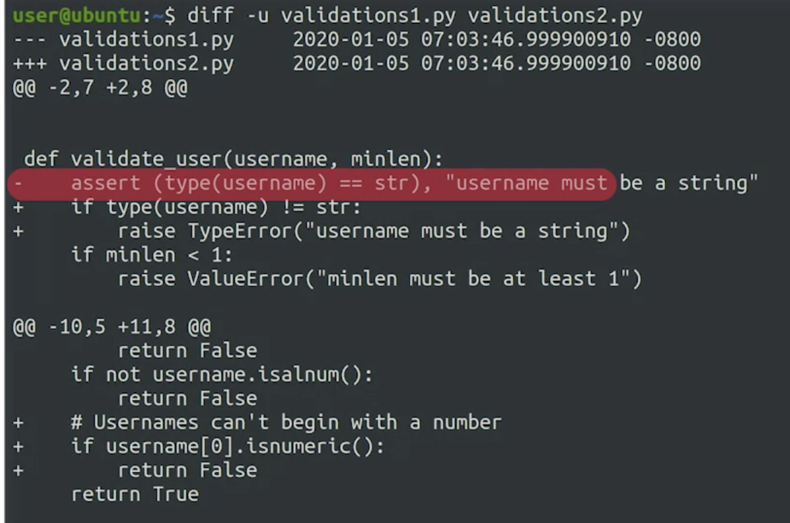

# Before Version Control

`diff -u validations1.py validations2.py`

`-u` adds context via + and - symbols.

To show difference in two files.
`diff -u old_file new_file > change.diff`

To apply changes from diff file.
`patch cpu_usage.py < cpu_usage.diff`

# Using Git

Modified, Staged, Committed (File Stages)

`git config -l`
List git config

## The Basic Git Workflow

```bash

git status

git add

git commit -m ''

```

## Anatomy of a Commit Message

There may be company specific guide for commit messages.

50 characters or less. Short description followed by one or more paragraphs if needed.

