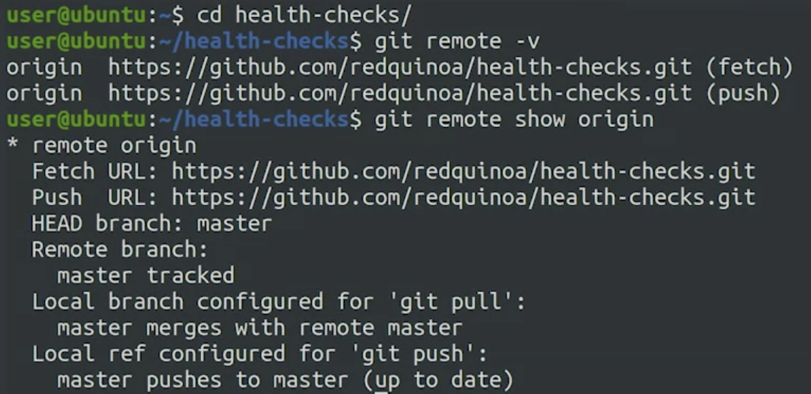
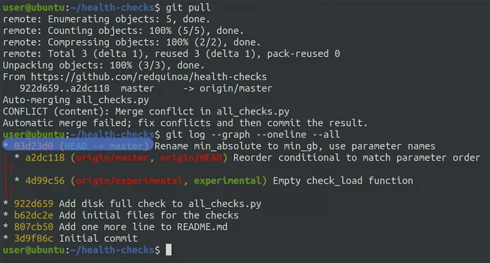

# Week 3 - Basic Interaction with Github

## Introduction to Github

Lessens password entry.

`git config --global credential.helper cache`

### Basic Interaction with GitHub Cheat-Sheet

There are various remote repository hosting sites:

- [GitHub](http://github.com/)
- [BitBucket](https://bitbucket.org/product)
- [Gitlab](https://gitlab.com/).

Follow the workflow at https://github.com/join to set up a free account, username, and password. After that, [these steps](https://help.github.com/articles/create-a-repo/) will help you create a brand new repository on GitHub.

Some useful commands for getting started:

| Command | Explanation & Link |
| --- | --- |
| git clone URL | https://git-scm.com/docs/git-clone |
| git push | https://git-scm.com/docs/git-push |
| git pull | https://git-scm.com/docs/git-pull |

This can be useful for keeping your local workspace up to date.

- https://help.github.com/en/articles/caching-your-github-password-in-git
- https://help.github.com/en/articles/generating-an-ssh-key

## Using A Remote Repository

When working with remotes:

Modify, Stage, Commit local changes, Fetch any new changes, manuall merge, then push to remote.

`git clone` sets up a remote automatically.

`git remote -v` shows urls with remote repo.

`origin` name assigned to remote.

`git remote show origin` shows more details regarding remote.

Whenever we are operating with remotes, git uses remote branches to keep copies of the data that's stored in the remote repository.

`git branch -r` shows remotes that git is tracking.

`git fetch` downloads to remote branches in local repo

`git checkout` should be run to see working tree and `git log` to see commit history

`git merge origin/master` mergest changes between remote repo and local.

### Git Remotes Cheat-Sheet

| Command | Explanation & Links |
| --- | --- |
| git remote | https://git-scm.com/docs/git-remote |
| git remote -v | https://git-scm.com/docs/git-remote#Documentation/git-remote.txt--v |
| git remote show <name> | https://git-scm.com/docs/git-remote#Documentation/git-remote.txt-emshowem |
| git remote update | https://git-scm.com/docs/git-remote#Documentation/git-remote.txt-emupdateem |
| git fetch | https://git-scm.com/docs/git-fetch |
| git branch -r | https://git-scm.com/docs/git-branch#Documentation/git-branch.txt--r; can be combined with other branch arguments to manage remote branches |

You can also see more in the video [Cryptography in Action](https://www.coursera.org/learn/it-security/item/P1I8z) from the course [IT Security: Defense against the digital dark arts](https://www.coursera.org/learn/it-security/home/welcome).

## Solving Conflicts

### The Pull-Merge-Push Workflow

If there are changes to remote, those changes have to be pulled first.

Pulling may indicate conflicts.

Three way merge.

### Pushing Remote Branches

When using Git to work on a new feature or refactor of another kind, it is best practice to create branches.

`git checkout -b` create branch and checkout

`git push -u origin <branch>` push branch to remote

`git push -u origin <branch>` push branch to remote

### Rebasing Changes

`git rebase` change base commit that is used for our branch.

### Best Practices for Collaboration

- Always synchronize your branches before starting any work on your own.
- Avoid having very large changes that modify a lot of different things.
- We called out already that when working on a big change, it makes sense to have a separate feature branch.
- Regularly merge changes made on the master branch back onto the feature branch.
- Practice to have the latest version of the project in the master branch and a stable version of the project on a separate branch.
- Never rebase changes that have been pushed to remote repos.
- Having good commit changes is important.
  
### Conflict Resolution Cheat Sheet

Merge conflicts are not uncommon when working in a team of developers, or on Open Source Software. Fortunately, GitHub has some good documentation on how to handle them when they happen:

- https://help.github.com/en/github/collaborating-with-issues-and-pull-requests/about-merge-conflicts
- https://help.github.com/en/github/collaborating-with-issues-and-pull-requests/resolving-a-merge-conflict-using-the-command-line

You can also use [git rebase branchname](https://git-scm.com/book/en/v2/Git-Branching-Rebasing) to change the base of the current branch to be branchname

The git rebase command is a lot more powerful.  Check out [this link](https://git-scm.com/book/en/v2/Git-Tools-Rewriting-History) for more information.

